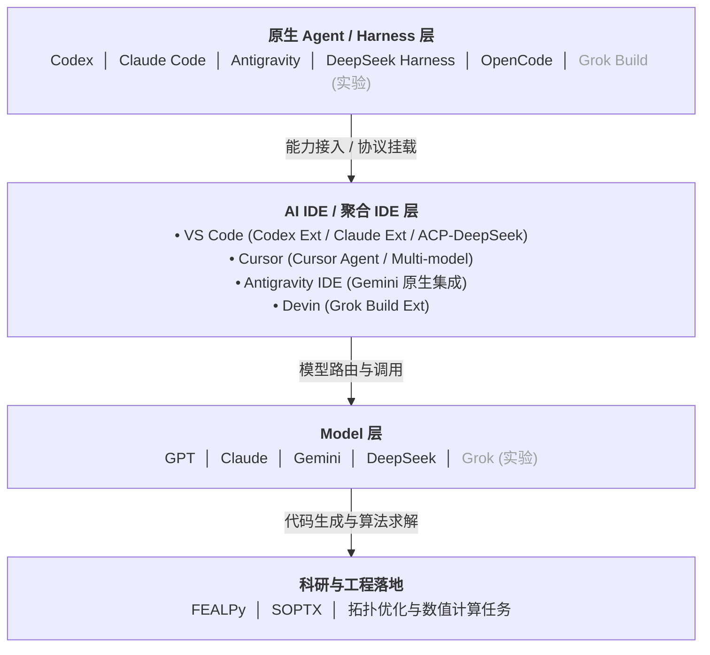

# AI 工作流架构与 Agent 教程导读

本目录收录各 AI Agent / 辅助开发工具在本地工作区（Windows 与 WSL 双轨）的**接入教程、架构分层与使用指南**。

---

## 1. 工作流全景架构

当前开发与科研体系采用**分层解耦、多模型路由与多 IDE 聚合**的架构设计：

---

## 2. 架构分层说明

### 2.1 原生 Agent / Harness 层 (Native CLI / Harness)
- **Codex (CLI)**：OpenAI 官方原生的终端与 Agent 执行内核。
- **Claude Code**：Anthropic 官方的高自主性命令行编程 Agent。
- **Antigravity**：深度融合规划模式（Plan / Goal）与多 Agent 协作的专用工作流引擎。
- **DeepSeek Harness**：基于标准配置分层与 ACP 协议的专用开源模型 Agent Harness。
- **OpenCode**：开源、模型中立（Model-Agnostic）的终端原生 TUI / CLI 编程 Agent，在 WSL 下提供完整的 Linux 工具链调用。
- **Grok Build（实验）**：xAI 生态的构建与探索性 Agent。

### 2.2 AI IDE / 聚合 IDE 层 (Interactive Hub)
- **VS Code**：通用插件与多 Agent 协议总线。通过官方/社区扩展（Codex Ext、Claude Ext）接入，并通过 **ACP (Agent Client Protocol) Client** 挂载 DeepSeek Harness。
- **Cursor**：交互式代码编辑与多模型辅助中心。依托 Cursor Agent 及 Multi-model 路由，实现高效的代码补全与跨模型原型对比。
- **Antigravity IDE**：深度结合 Gemini 原生能力的 Agent 专用集成开发环境，擅长复杂工程规划、工具链调用与上下文治理。
- **Devin**：基于 VS Code 生态的 AI IDE 环境，当前主要通过安装配置 **Grok Build Ext** 接入并调用 Grok 模型能力。

### 2.3 Model 层 (Foundation Models)
- **主力模型**：`GPT`、`Claude`、`Gemini`、`DeepSeek`。根据代码推理、上下文长度、数学建模（拓扑优化灵敏度推导、有限元矩阵组装）等不同任务特点按需调度。
- **探索模型**：`Grok`（实验阶段，按需评估测试）。

### 2.4 科研与工程落地 (Domain & Workloads)
- **核心算法库**：`FEALPy`（Python 有限元基础库）、`SOPTX`（结构拓扑优化库）。
- **双轨运行环境**：
  - **Windows 宿主 (`authoring`)**：`C:\workspace`，负责代码编写、文档撰写、Git 版本控制与环境治理。
  - **WSL Ubuntu-24.04 (`compute`)**：`~/workspace`，负责 GPU 求解、高性能 Python 科学计算仿真与收敛验证。

---

## 3. 工具教程与指南索引

| 工具 / 体系 | 使用指南 | 能力导读 | Token 优化 / 高级配置 |
| :--- | :--- | :--- | :--- |
| **Claude Code** | [Claude 指南](Claude/claude-guide.md) | [能力清单](Claude/capabilities.md) | [Token 优化](Claude/token-optimization.md) |
| **Codex** | [Codex 指南](Codex/codex-guide.md) | [能力清单](Codex/capabilities.md) | [Token 优化](Codex/token-optimization.md) |
| **DeepSeek** | [DeepSeek 指南](DeepSeek/deepseek-guide.md) | [能力清单](DeepSeek/capabilities.md) | [ACP 接入指南](DeepSeek/deepseek-guide.md#5-vs-code-通过-agent-client-protocol-acp-接入-deepseek-harness) |
| **Grok** | [Grok 指南](Grok/grok-guide.md) | [能力清单](Grok/capabilities.md) | [Grok 概览](Grok/README.md) |
| **OpenCode** | [OpenCode 指南](OpenCode/opencode-guide.md) | [能力清单](OpenCode/capabilities.md) | [全局规则管理](../agent-rules/OpenCode/README.md) |
| **Antigravity** | [Antigravity 规则](../agent-rules/Antigravity/README.md) | - | [GEMINI.md](../agent-rules/Antigravity/GEMINI.md) |
