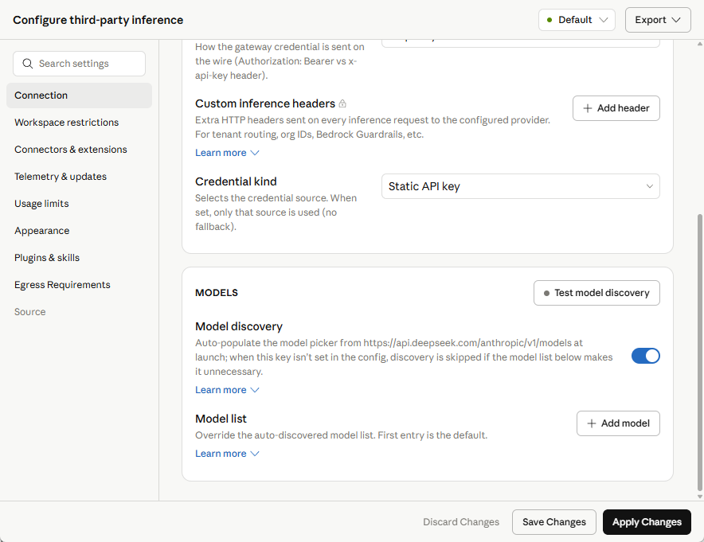
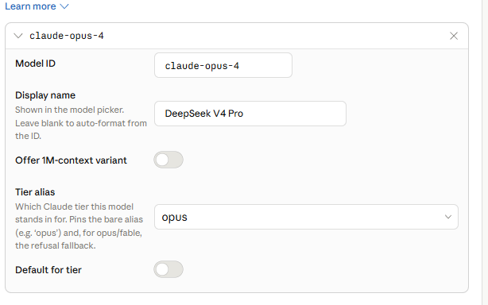
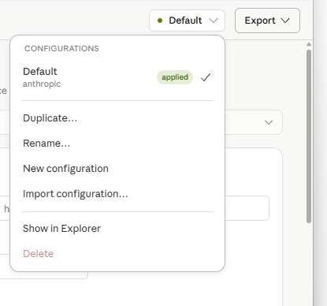

# Claude Code Desktop 接入 DeepSeek API 与双配置切换指南

> - 适用环境：Windows 11、Claude Desktop 的 **Code** 页面（下文简称“Claude Code Desktop”）
> - 整理日期：2026-08-03
> - 本文基于一次实际配置过程整理，重点记录 DeepSeek 接入、模型映射、模型发现 404、Claude 订阅恢复，以及如何避免配置被覆盖。

> [!NOTE]
> 本文已于 2026-08-03 对照 DeepSeek Anthropic API、DeepSeek Claude Code 接入说明
> 和 Anthropic Claude Desktop 第三方推理配置重新核验。DeepSeek 官方的 Claude Code
> 指南主要给出 CLI 环境变量；本文记录的是 Claude Desktop Code 页面中的 Gateway
> 图形界面流程，两者不要混用。

---

## 1. 最终目标

建立两套彼此独立的配置：

```text
Claude Subscription
└── Claude API
    └── Interactive sign-in
        └── 使用 Claude.ai 订阅额度

DeepSeek API
└── Gateway
    ├── https://api.deepseek.com/anthropic
    ├── Static API key + x-api-key
    ├── DeepSeek V4 Pro
    └── DeepSeek V4 Flash
```

以后通过右上角的配置档案菜单切换，而不是在同一个 `Default` 配置中反复改写连接参数。

---

## 2. 先理解协议与模型映射

Claude Code Desktop 原生使用 **Anthropic Messages API**。因此接入 DeepSeek 时，应使用 DeepSeek 的 Anthropic 兼容接口：

```text
https://api.deepseek.com/anthropic
```

它与 Codex 使用的 OpenAI Responses API 不是同一套协议：

| 客户端 | 协议 | DeepSeek 接入方式 |
|---|---|---|
| Codex | OpenAI Responses API | `https://api.deepseek.com` |
| Claude Code Desktop | Anthropic Messages API | `https://api.deepseek.com/anthropic` |

这个 Desktop 方案由两部分共同成立：Anthropic 官方第三方推理配置支持
`Gateway + Static API key + x-api-key`，DeepSeek 官方 Anthropic 兼容接口则支持
`x-api-key` 并明确说明可用于新版 Claude Desktop App 的 developer 模式。DeepSeek
官方 Claude Code CLI 文档中的 `ANTHROPIC_BASE_URL`、`ANTHROPIC_AUTH_TOKEN` 等环境
变量仅作为 CLI 参考，不应填写到本文的 Desktop 配置档案中。

DeepSeek 官方会按照 Claude 模型名前缀进行映射：

| Claude Desktop 中发送的模型 ID | DeepSeek 实际调用模型 |
|---|---|
| `claude-opus...` | `deepseek-v4-pro` |
| `claude-sonnet...` | `deepseek-v4-flash` |
| `claude-haiku...` | `deepseek-v4-flash` |

因此，DeepSeek Responses API 当前不支持 V4 Pro，并不影响 Claude Code Desktop 通过 **Anthropic API** 使用 V4 Pro。

---

## 3. 配置前准备

需要提前准备：

1. 已安装并登录过 Claude Desktop；
2. 已在 DeepSeek 开放平台充值 API 余额；
3. 已创建以 `sk-` 开头的 DeepSeek API Key；
4. API Key 仅在本机配置窗口中填写，不要上传截图、写入公开仓库或发送给他人。

建议为 Claude Code Desktop 单独创建一个 DeepSeek API Key，便于后续查看用量、吊销和轮换。

---

## 4. 开启 Claude Desktop 开发者模式

在 Claude Desktop 中依次进入：

```text
Help
→ Troubleshooting
→ Enable Developer Mode
```

重启应用后，打开：

```text
Developer
→ Configure Third-Party Inference...
```

打开后会进入第三方推理配置窗口，左侧选择 `Connection`，右侧设置提供方、认证和
模型列表。原始总览截图带有与本操作无关的窗口内容，因此未归档到本公开仓库；后续
各步骤保留了只包含相关配置控件的截图。

---

## 5. 推荐：先新建独立的 DeepSeek 配置档案

为了避免覆盖 Claude 订阅配置，建议在填写 DeepSeek 参数之前先操作：

```text
右上角 Default ▼
→ New configuration
→ 命名为 DeepSeek API
```

若当前已经把 `Default` 配置成 Claude 订阅，可保留它作为：

```text
Default → Claude Subscription
```

然后新建：

```text
DeepSeek API → DeepSeek Gateway
```

> 本次实际操作一开始直接修改了 `Default`。后来切换回 Claude API 并应用时，DeepSeek 参数被覆盖，因此最终需要重新创建独立配置。详细处理见第 11 节。

---

## 6. 配置 DeepSeek 连接参数

在 `Connection` 中选择：

```text
Gateway
```

填写下列参数：

| 字段 | 值 |
|---|---|
| Gateway base URL | `https://api.deepseek.com/anthropic` |
| Custom inference headers | 留空 |
| Credential kind | `Static API key` |
| Gateway API key | 填写 DeepSeek API Key |
| Gateway auth scheme | `x-api-key` |

关键点：

- Base URL 必须包含 `/anthropic`；
- 不要使用 Codex 的 `https://api.deepseek.com/`；
- DeepSeek 官方明确支持 `x-api-key` 请求头；
- 不要把 DeepSeek Key 填到 Claude API 的 `sk-ant-...` 输入框中。

---

## 7. 处理模型发现 404

### 7.1 自动模型发现测试

配置窗口会尝试访问：

```text
https://api.deepseek.com/anthropic/v1/models
```

模型发现区域如下：



点击 `Test model discovery` 后，本次实际返回：

```text
Model discovery — Gateway /v1/models returned HTTP 404
```


### 7.2 404 的含义

这个 404 表示 DeepSeek 的 Anthropic 兼容入口没有提供 Claude Desktop 所尝试的 `/v1/models` 自动发现端点。

它**不等于**：

- API Key 一定错误；
- Base URL 一定错误；
- Anthropic Messages API 无法调用；
- DeepSeek 模型不可用。

正确处理方式是：

1. 关闭 `Model discovery`；
2. 在 `Model list` 中手动添加模型。

---

## 8. 手动添加 DeepSeek 模型

关闭 `Model discovery` 后，点击：

```text
+ Add model
```

添加表单如下：


### 8.1 添加 DeepSeek V4 Pro

填写：

| 字段 | 值 |
|---|---|
| Model ID | `claude-opus-4` |
| Display name | `DeepSeek V4 Pro` |
| Offer 1M-context variant | 初次测试保持关闭 |
| Tier alias | `opus` |
| Default for tier | 开启 |

配置示例：



说明：

```text
Claude Code 请求 claude-opus-4
→ DeepSeek 根据 claude-opus 前缀映射
→ 实际调用 deepseek-v4-pro
```

### 8.2 添加 DeepSeek V4 Flash

继续点击 `+ Add`，填写：

| 字段 | 值 |
|---|---|
| Model ID | `claude-sonnet-4` |
| Display name | `DeepSeek V4 Flash` |
| Offer 1M-context variant | 初次测试保持关闭 |
| Tier alias | `sonnet` |
| Default for tier | 开启 |

说明：

```text
Claude Code 请求 claude-sonnet-4
→ DeepSeek 根据 claude-sonnet 前缀映射
→ 实际调用 deepseek-v4-flash
```

最终模型列表如下：


### 8.3 `Default for tier` 是否都要开启

可以同时开启，因为二者属于不同 tier：

```text
opus   → DeepSeek V4 Pro
sonnet → DeepSeek V4 Flash
```

同一个 tier 中不要同时设置多个默认模型。

### 8.4 哪一个是整个列表的默认模型

Claude Desktop 界面提示：

```text
First entry is the default.
```

因此第一项是整个模型选择器的默认模型。若希望默认省钱和更快，可把 Flash 放在第一项；若优先复杂任务质量，可把 Pro 放在第一项。

---

## 9. 保存、应用并验证 DeepSeek

完成后建议依次点击：

```text
Save Changes
→ Apply Changes
```

两者作用：

- `Save Changes`：保存当前配置档案；
- `Apply Changes`：把该档案设为当前生效配置。

随后完全退出 Claude Desktop，包括系统托盘中的后台进程，再重新打开。

配置生效后，模型选择器中只出现 DeepSeek 模型属于正常现象：


### 9.1 建议的首次测试

优先选择 `DeepSeek V4 Flash`，发送只读任务：

```text
请读取当前项目的目录结构并概括主要模块，不要修改任何文件。
```

然后检查：

1. Claude Code Desktop 是否正常返回；
2. 是否能读取项目和调用工具；
3. DeepSeek 开放平台是否出现 API 用量和余额变化。

第 3 项是确认请求确实经过 DeepSeek 的最可靠方式。

---

## 10. 切回 Claude.ai 订阅认证

第三方推理配置生效后，当前模型下拉框只显示 DeepSeek，这是因为该配置会把推理请求统一路由到 Gateway。

### 10.1 切换连接提供方

在第三方推理配置窗口的 `Connection` 中可选择不同提供方：


选择：

```text
Claude API
```

### 10.2 不要使用 Static API key

若界面显示：

```text
Credential kind: Static API key
Claude API key: sk-ant-...
```

这代表 **Anthropic Console API 按 token 计费**，不是 Claude.ai 订阅认证。


将 `Credential kind` 改为：

```text
Interactive sign-in
```

保持：

- Claude API Key 留空；
- Model discovery 开启；
- Model list 留空。

正确状态应为 `Claude API + Interactive sign-in`，同时 API Key 留空、Model
discovery 开启、Model list 留空。原始状态截图包含与本操作无关的任务上下文，因此
未归档到本公开仓库。

点击 `Apply Changes` 后，浏览器会打开认证页面。

### 10.3 登录页面如何选择

页面会提供两个入口：

- `Sign in with Claude Console`
- `Or sign in with Claude.ai`

要使用 Claude Pro、Max 等订阅额度，应选择：

```text
Or sign in with Claude.ai
```

不要选择 `Sign in with Claude Console`，后者使用 Anthropic API 组织并按 API 用量计费。


登录授权完成后返回 Claude Desktop，必要时完全退出并重启，模型列表会恢复为 Claude 官方模型。

---

## 11. 为什么切回 DeepSeek 时发现配置消失

本次实际操作中，DeepSeek 参数最初保存在同一个 `Default` 配置中。随后将 `Default` 改为 `Claude API + Interactive sign-in` 并应用，原来的 Gateway 参数和模型列表被新内容覆盖。

再次选择 Gateway 后，界面只剩空白占位字段，表明原来的 Gateway 参数已经被当前
`Default` 档案的新内容覆盖。原始截图包含与本操作无关的任务上下文，因此未归档。

打开右上角菜单后，只有一份 `Default` 配置：



这说明此前没有把 DeepSeek 另存为独立档案。

### 11.1 恢复方法

1. 点击右上角配置菜单；
2. 选择 `New configuration`；
3. 命名为 `DeepSeek API`；
4. 按第 6～8 节重新填写；
5. 点击 `Save Changes`；
6. 点击 `Apply Changes`。

### 11.2 推荐的双配置结构

最终保留：

```text
Default / Claude Subscription
├── Connection: Claude API
├── Credential kind: Interactive sign-in
├── Model discovery: On
└── Model list: Empty

DeepSeek API
├── Connection: Gateway
├── Base URL: https://api.deepseek.com/anthropic
├── Credential kind: Static API key
├── Auth scheme: x-api-key
├── Model discovery: Off
├── claude-opus-4 → DeepSeek V4 Pro
└── claude-sonnet-4 → DeepSeek V4 Flash
```

以后只通过配置档案菜单选择对应档案并 `Apply Changes`，不要在同一个档案里反复修改 Provider。

---

## 12. 配置文件在 Windows 中的位置

Claude Desktop 的本地第三方推理配置库位于：

```text
%LOCALAPPDATA%\Claude-3p\configLibrary\
```

其中：

```text
_meta.json     → 记录当前应用的是哪一份配置
<id>.json      → 每一份已保存配置的独立文件
```

官方说明配置通常在应用启动时读取，因此修改或切换后应完全退出并重新打开 Claude Desktop。

不要手动公开这些文件，因为其中可能含有 API Key 或其他认证信息。

---

## 13. 常见问题排查

### 13.1 `Model discovery ... HTTP 404`

原因：DeepSeek Anthropic 入口没有提供 Claude Desktop 尝试调用的 `/v1/models`。

处理：

```text
关闭 Model discovery
→ 手动添加 claude-opus-4 和 claude-sonnet-4
```

### 13.2 返回 401 或认证失败

依次检查：

```text
Base URL 是否为 https://api.deepseek.com/anthropic
Credential kind 是否为 Static API key
Gateway auth scheme 是否为 x-api-key
API Key 是否完整、有效、未被吊销
DeepSeek 账户是否有可用余额
```

### 13.3 只有 DeepSeek 模型，看不到 Claude 模型

这是 Gateway 配置生效后的正常表现。切换到 Claude Subscription 配置并应用即可。

### 13.4 切回 Gateway 后参数为空

说明当前配置档案已被覆盖，或 DeepSeek 从未另存为独立档案。重新创建 `DeepSeek API` 配置并保存。

### 13.5 应用后模型列表没有刷新

完全退出 Claude Desktop，包括系统托盘后台进程，再重新启动。

### 13.6 DeepSeek 模式下图片或文档输入失败

DeepSeek Anthropic API 当前不支持 Anthropic 消息中的 `image` 和 `document` 内容类型。文本和工具调用可用，但涉及图片、文档内容块的 Claude 功能可能无法正常工作。

### 13.7 是否可以在 Claude Code Desktop 中使用 Responses API

不能原生直连。Claude Code Desktop 面向 Anthropic Messages API；Responses API 是 Codex 使用的协议。通过额外的协议转换网关理论上可以转换，但会增加复杂度，而且没有必要。

### 13.8 切换配置档案后看不到另一套配置的会话

现象：在 `Claude Subscription` 配置下看不到 DeepSeek 配置里创建的会话，反之亦然。

这是设计使然，无法通过配置解决。Desktop 的会话**列表**按认证身份做命名空间隔离：

- `Claude API + Interactive sign-in`：会话列表挂在登录的 Claude.ai 账号身份下；
- `Gateway + Static API key`：没有账号身份，会话记入本地匿名命名空间
  `%LOCALAPPDATA%\Claude-3p\claude-code-sessions\<命名空间>\...\local_*.json`。

两份列表互相不可见，官方文档没有提供共享或合并机制（并且明确说明用户本地数据
sessions、skills、plugins 按身份/组织 UUID 隔离）。

需要注意的边界：

1. **数据不会丢。** 隔离只发生在列表层；两种模式产生的会话原文（transcript）
   统一存放在 `%USERPROFILE%\.claude\projects\<项目路径>\<sessionId>.jsonl`，
   切回对应配置后各自的会话列表依然完整。
2. **确实需要跨提供方续接同一会话时，走 CLI 路线。** DeepSeek 官方的
   Claude Code CLI 接法（`ANTHROPIC_BASE_URL` 等环境变量）下，提供方只是环境
   变量，`claude --resume` 按项目目录列出 `~\.claude\projects` 中的全部会话，
   与后端无关。Desktop 的 Gateway 路线做不到这一点。
3. CLI 续接的两个注意点：续接时**整个历史上下文会重放发送给 DeepSeek**，保密
   要求高的项目慎用；历史中含 image、document 内容块时 DeepSeek Anthropic
   接口不支持（见 13.6），可能直接报错。

不建议手改 `claude-code-sessions` 里的索引 JSON 来“搬”会话：这是未文档化的
内部格式，条目挂在身份命名空间下，应用升级或同步时可能被清理。

### 13.9 推荐组合：Desktop 走 Claude 订阅，CLI 走 DeepSeek

如果两套配置都放在 Desktop 里嫌切换麻烦，更顺的分工是：

```text
Desktop → Claude API + Interactive sign-in（订阅，保持不动）
CLI     → DeepSeek 环境变量接法（按次注入，不污染其他会话）
```

可行性依据（官方 authentication 文档）：

1. 认证优先级中 `ANTHROPIC_AUTH_TOKEN` 环境变量（第 2 位）高于订阅 OAuth 登录
   （第 6 位）——设了变量的终端走 DeepSeek，没设的照常走订阅，无需 `/logout`；
2. 官方明确 Claude Desktop 不读取这些环境变量（它用 OAuth 或第三方推理配置的
   凭据），所以 CLI 侧的变量不会影响 Desktop。

实施方式：在 PowerShell `$PROFILE` 中加一个 wrapper（本机已同时写入 pwsh 7 与
Windows PowerShell 5.1 的 profile），API Key 存放在用户环境变量
`DEEPSEEK_API_KEY` 中：

```powershell
function claude-ds {
    if (-not $env:DEEPSEEK_API_KEY) {
        Write-Error "DEEPSEEK_API_KEY is not set."
        return
    }
    $env:ANTHROPIC_BASE_URL = "https://api.deepseek.com/anthropic"
    $env:ANTHROPIC_AUTH_TOKEN = $env:DEEPSEEK_API_KEY
    $env:ANTHROPIC_MODEL = "deepseek-v4-pro"
    $env:ANTHROPIC_DEFAULT_OPUS_MODEL = "deepseek-v4-pro"
    $env:ANTHROPIC_DEFAULT_SONNET_MODEL = "deepseek-v4-pro"
    $env:ANTHROPIC_DEFAULT_HAIKU_MODEL = "deepseek-v4-flash"
    $env:CLAUDE_CODE_SUBAGENT_MODEL = "deepseek-v4-flash"
    $env:CLAUDE_CODE_EFFORT_LEVEL = "max"
    try { claude @args }
    finally {
        Remove-Item Env:ANTHROPIC_BASE_URL, Env:ANTHROPIC_AUTH_TOKEN, Env:ANTHROPIC_MODEL,
            Env:ANTHROPIC_DEFAULT_OPUS_MODEL, Env:ANTHROPIC_DEFAULT_SONNET_MODEL,
            Env:ANTHROPIC_DEFAULT_HAIKU_MODEL, Env:CLAUDE_CODE_SUBAGENT_MODEL,
            Env:CLAUDE_CODE_EFFORT_LEVEL -ErrorAction SilentlyContinue
    }
}
```

环境变量取值来自 DeepSeek 官方 Claude Code 接入文档。用法与验证：

- `claude-ds` 走 DeepSeek，同一终端里的普通 `claude` 仍走订阅；
- 启动 banner 显示 `deepseek-v4-pro · API Usage Billing` 即接入成功；
- 会出现黄色提示 `claude.ai connectors are disabled because ANTHROPIC_API_KEY
  or another auth source is set...`：这是预期行为，表示环境变量认证优先于
  claude.ai 登录、账号侧 connectors 在本会话不加载，无配置项可关闭；
- 不要把这些变量设成用户级/系统级环境变量或写入 `~\.claude\settings.json` 的
  `env` 块，否则所有 CLI 会话都会变成 DeepSeek。

会话共享效果是**单向**的：CLI 的 `claude-ds --resume` 能列出并续接 Desktop
创建的会话（transcript 共用 `~\.claude\projects`），但 Desktop 的列表看不到
CLI 创建的会话。跨后端续接的隐私与 image/document 限制见 13.8。

---

## 14. 安全建议

1. 不要在截图、聊天记录或 GitHub 仓库中暴露完整 API Key；
2. 为不同客户端分别创建 API Key；
3. 定期检查 DeepSeek API 用量；
4. 怀疑泄露时立即删除旧 Key 并创建新 Key；
5. 不要把 DeepSeek Key 填入 Claude API 的 `sk-ant-...` 字段；
6. 第三方推理模式下，项目上下文会发送给所配置的第三方模型服务，应根据项目保密要求决定是否使用。

---

## 15. 最终检查清单

### DeepSeek API 配置

- [ ] 使用独立配置档案 `DeepSeek API`
- [ ] Connection = `Gateway`
- [ ] Base URL = `https://api.deepseek.com/anthropic`
- [ ] Credential kind = `Static API key`
- [ ] Auth scheme = `x-api-key`
- [ ] Model discovery = Off
- [ ] `claude-opus-4` / alias `opus` / Default for tier On
- [ ] `claude-sonnet-4` / alias `sonnet` / Default for tier On
- [ ] Save Changes 后再 Apply Changes
- [ ] 重启后完成只读测试
- [ ] DeepSeek 控制台出现调用记录

### Claude 订阅配置

- [ ] 使用独立配置档案 `Claude Subscription` 或保留 `Default`
- [ ] Connection = `Claude API`
- [ ] Credential kind = `Interactive sign-in`
- [ ] API Key 留空
- [ ] Model discovery = On
- [ ] Model list 留空
- [ ] 浏览器中选择 `Or sign in with Claude.ai`
- [ ] 重启后恢复 Claude 官方模型

---

## 16. 官方参考资料

1. [DeepSeek：使用 Anthropic API](https://api-docs.deepseek.com/zh-cn/guides/anthropic_api/)
2. [DeepSeek：将 DeepSeek 接入 Claude Code](https://api-docs.deepseek.com/zh-cn/quick_start/agent_integrations/claude_code/)
3. [Anthropic：Claude Desktop 第三方推理 Gateway 配置](https://claude.com/docs/third-party/claude-desktop/gateway)
4. [Anthropic：Claude Desktop 第三方推理配置参考](https://claude.com/docs/third-party/claude-desktop/configuration)
5. [Anthropic：Claude Desktop 第三方推理安装与切换说明](https://claude.com/docs/third-party/claude-desktop/installation)
6. [Anthropic：Claude Code 认证说明](https://code.claude.com/docs/en/authentication)

---

## 17. 一句话总结

```text
DeepSeek：Gateway + /anthropic + Static API key + x-api-key + 手动模型映射
Claude 订阅：Claude API + Interactive sign-in + Claude.ai 登录
长期使用：分别保存为两份配置档案，通过档案菜单切换
更省事的组合：Desktop 保持订阅，CLI 用 claude-ds 走 DeepSeek（见 13.9）
```
