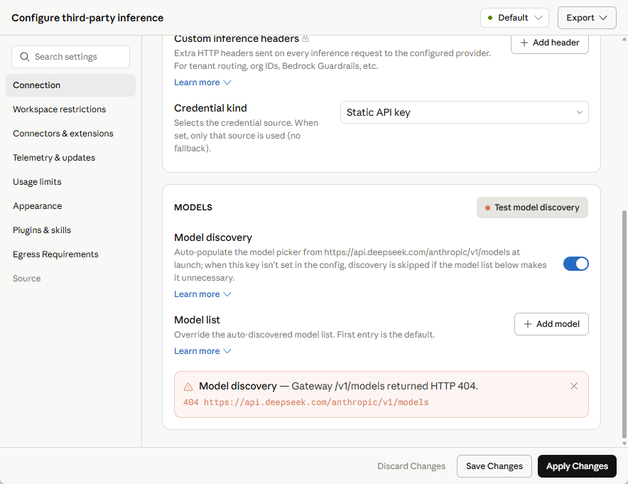
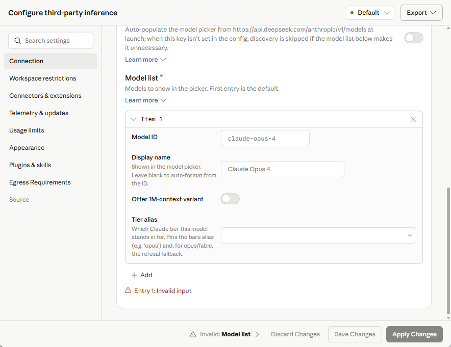
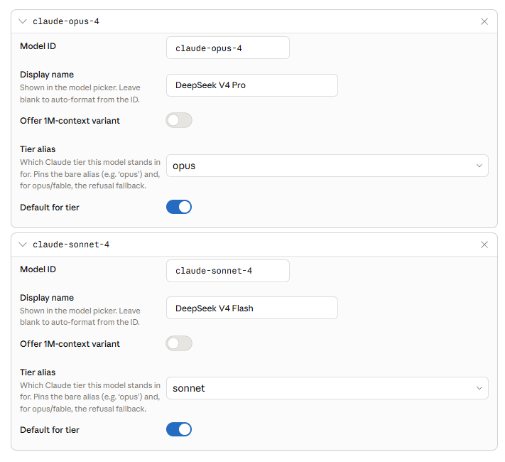
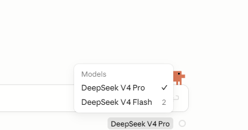
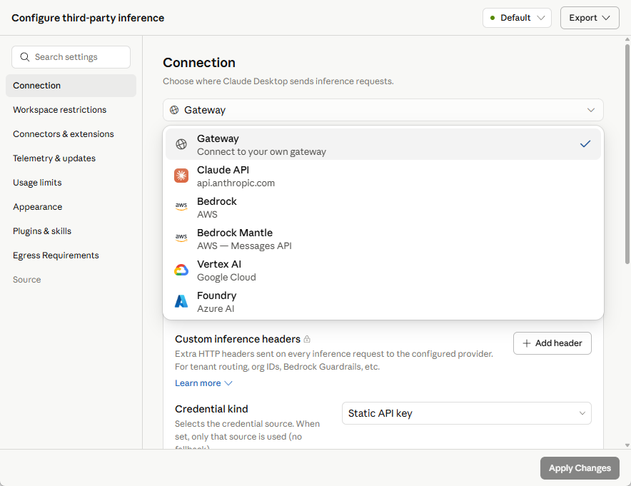
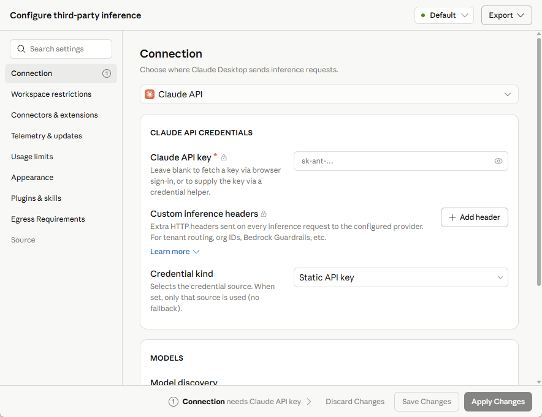
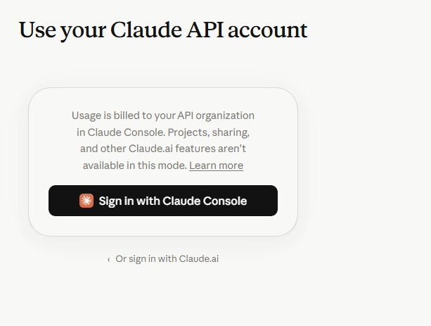

# Windows Claude Code 使用 DeepSeek，并保留 Claude 订阅

> - 整理日期：2026-08-04
> - 适用环境：Windows 11、Claude Code CLI（PowerShell）、Claude Desktop 的 **Code** 页面（下文简称“Claude Code Desktop”）
> - 推荐方案：仅让 CLI 使用 DeepSeek；Desktop 保持 Claude 订阅

> [!NOTE]
> 本文已于 2026-08-03 对照 DeepSeek 与 Anthropic 官方文档核验；Desktop 部分基于一次实际配置过程整理，保留当时的截图。

本文给出两种方式：

| 方式 | 影响范围 | 使用场景 |
| --- | --- | --- |
| **CLI wrapper claude-ds（推荐）** | 仅 claude-ds 启动的 CLI 会话 | CLI 调用计入 DeepSeek API，Desktop 继续使用 Claude 订阅 |
| Desktop Gateway 双配置档案 | Desktop 当前生效的配置档案 | 需要在 Desktop 图形界面中直接使用 DeepSeek |

推荐方式通过 PowerShell wrapper 按次注入环境变量。它不改动任何持久配置；普通 `claude` 和 Claude Code Desktop 继续使用 Claude 订阅。Codex 侧的对应做法见 [codex/deepseek-api](../../codex/deepseek-api/README.md)。

> [!WARNING]
> DeepSeek API Key 是敏感凭据。不要把 Key 发到聊天、贴进截图、写入仓库或提交到 Git。本文的命令不会打印 Key；输入 Key 的步骤不要截图。

## 1. 前置条件与限制

开始前应具备：

1. 已安装并登录过 Claude Desktop；使用 CLI 方式时，还应能在 PowerShell 中运行 `claude --version`；
2. 已在 DeepSeek 开放平台创建以 `sk-` 开头的 API Key 并充值余额；建议为 Claude Code 单独创建一个 Key，便于查看用量、吊销和轮换；
3. CLI 方式使用 Windows PowerShell，而不是 WSL 或 Git Bash。

接入协议：Claude Code 原生使用 **Anthropic Messages API**，因此 Base URL 是 DeepSeek 的 Anthropic 兼容接口 `https://api.deepseek.com/anthropic`——与 Codex 使用的 `https://api.deepseek.com`（OpenAI Responses API）不是同一套协议。DeepSeek 按 Claude 模型名前缀映射实际调用的模型：

| 发送的模型 ID | DeepSeek 实际调用模型 |
|---|---|
| `claude-opus...` | `deepseek-v4-pro` |
| `claude-sonnet...` | `deepseek-v4-flash` |
| `claude-haiku...` | `deepseek-v4-flash` |

因此，DeepSeek Responses API 当前不支持 V4 Pro，并不影响 Claude Code 通过 **Anthropic API** 使用 V4 Pro。

限制：无论哪种方式，DeepSeek Anthropic API 当前都不支持消息中的 `image` 和 `document` 内容类型（见常见问题），涉及图片、文档输入的任务应切回 Claude 官方模型；项目上下文会发送给 DeepSeek，应根据项目保密要求决定是否使用。

## 2. 推荐：建立独立 DeepSeek CLI

两套配置都放在 Desktop 里需要反复切换档案（见第 4 节），更顺的分工是：

```text
Desktop → Claude API + Interactive sign-in（订阅，保持不动）
CLI     → DeepSeek 环境变量接法（按次注入，不污染其他会话）
```

### 2.1 原理与官方依据

可行性依据（官方 authentication 文档）：

1. 认证优先级中 `ANTHROPIC_AUTH_TOKEN` 环境变量（第 2 位）高于订阅 OAuth 登录
   （第 6 位）——设了变量的终端走 DeepSeek，没设的照常走订阅，无需 `/logout`；
2. 官方明确 Claude Desktop 不读取这些环境变量（它用 OAuth 或第三方推理配置的
   凭据），所以 CLI 侧的变量不会影响 Desktop。

环境变量取值来自 DeepSeek 官方 Claude Code 接入文档。

### 2.2 将 Key 保存为当前用户环境变量

该变量与 Codex 独立 CLI 方案共用同一个 `DEEPSEEK_API_KEY`。设置方法（含隐藏输入、不回显 Key 的完整命令）见 [codex 侧指南](../../codex/deepseek-api/README.md)第 2.5 节；已设置过则跳过本步。

### 2.3 添加 claude-ds 启动命令

此命令把启动函数加入当前 PowerShell Host 的 Profile。函数只在自身运行期间注入 `ANTHROPIC_*` 变量，退出后由 `finally` 清理：

```powershell
$profilePath = $PROFILE
$profileDir = Split-Path -Parent $profilePath
$marker = '# >>> Claude DeepSeek launcher >>>'

if (-not (Test-Path -LiteralPath $profileDir)) {
    New-Item -ItemType Directory -Path $profileDir -Force | Out-Null
}
if ((Test-Path -LiteralPath $profilePath) -and
    (Select-String -LiteralPath $profilePath -SimpleMatch -Pattern $marker -Quiet)) {
    throw "启动命令已存在于：$profilePath"
}

$launcher = @'
# >>> Claude DeepSeek launcher >>>
function claude-ds {
    if (-not $env:DEEPSEEK_API_KEY) {
        Write-Error "DEEPSEEK_API_KEY is not set."
        return
    }
    $env:ANTHROPIC_BASE_URL = "https://api.deepseek.com/anthropic"
    $env:ANTHROPIC_AUTH_TOKEN = $env:DEEPSEEK_API_KEY
    $env:ANTHROPIC_MODEL = "deepseek-v4-pro"
    $env:ANTHROPIC_DEFAULT_OPUS_MODEL = "deepseek-v4-pro"
    $env:ANTHROPIC_DEFAULT_SONNET_MODEL = "deepseek-v4-pro"
    $env:ANTHROPIC_DEFAULT_HAIKU_MODEL = "deepseek-v4-flash"
    $env:CLAUDE_CODE_SUBAGENT_MODEL = "deepseek-v4-flash"
    $env:CLAUDE_CODE_EFFORT_LEVEL = "max"
    try { claude @args }
    finally {
        Remove-Item Env:ANTHROPIC_BASE_URL, Env:ANTHROPIC_AUTH_TOKEN, Env:ANTHROPIC_MODEL,
            Env:ANTHROPIC_DEFAULT_OPUS_MODEL, Env:ANTHROPIC_DEFAULT_SONNET_MODEL,
            Env:ANTHROPIC_DEFAULT_HAIKU_MODEL, Env:CLAUDE_CODE_SUBAGENT_MODEL,
            Env:CLAUDE_CODE_EFFORT_LEVEL -ErrorAction SilentlyContinue
    }
}
# <<< Claude DeepSeek launcher <<<
'@

Add-Content -LiteralPath $profilePath -Value $launcher -Encoding utf8NoBOM
. $profilePath
Get-Command claude-ds | Select-Object Name, CommandType, Source
```

最后一行应显示 claude-ds，且 CommandType 为 Function。

pwsh 7 与 Windows PowerShell 5.1 的 `$PROFILE` 相互独立；两种终端都要使用时，在各自终端中分别执行一次（本机已同时写入两者）。

> [!IMPORTANT]
> 不要把这些 `ANTHROPIC_*` 变量设成用户级/系统级环境变量或写入 `~\.claude\settings.json` 的 `env` 块，否则所有 CLI 会话都会变成 DeepSeek。wrapper 只在自身运行期间注入，退出后恢复终端原环境。

## 3. 验证与日常使用

### 3.1 首次启动

打开新 PowerShell，运行：

```powershell
claude-ds
```

启动 banner 显示 `deepseek-v4-pro · API Usage Billing` 即接入成功。会出现黄色提示
`claude.ai connectors are disabled because ANTHROPIC_API_KEY or another auth
source is set...`：这是预期行为，表示环境变量认证优先于 claude.ai 登录、账号侧
connectors 在本会话不加载，无配置项可关闭。

输入下列最小测试并发送：

```text
只回复 OK
```

收到 OK 后，在 DeepSeek 开放平台确认出现 API 用量和余额变化——这是确认请求确实经过 DeepSeek 的最可靠方式。

### 3.2 以后如何区分两种入口

| 要使用的模型与额度 | 命令或入口 |
| --- | --- |
| DeepSeek API | claude-ds |
| Claude 订阅 | 普通 claude 或 Claude Code Desktop |

同一终端里的普通 `claude` 仍走订阅；DeepSeek 的实际费用从其 API 账户余额中扣除，不消耗 Claude 订阅额度。

### 3.3 在独立 CLI 中选择多个模型

wrapper 的默认模型是 `deepseek-v4-pro`，可用的另一个模型是 `deepseek-v4-flash`。切换时优先用命令行参数按次指定，它只作用于该次会话，优先级高于 wrapper 注入的 `ANTHROPIC_MODEL`：

```powershell
claude-ds --model deepseek-v4-flash
```

也可在会话内输入 `/model` 打开选择器；wrapper 已设好别名映射（`opus`/`sonnet` → V4 Pro，`haiku` → V4 Flash），别名同样可用。

> [!WARNING]
> Claude Code v2.1.153 起，在 `/model` 选择器里按 `Enter`（以及直接输入 `/model <name>`）会把选择写入用户 settings，作为**以后所有新会话**的默认模型。在 claude-ds 会话里这样选 DeepSeek 模型会污染订阅会话——下次普通 `claude` 会带着 DeepSeek 模型名请求 Anthropic API 而报 model not found。会话内切换务必在选择器里按 `s`（仅本会话生效），不要按 `Enter`。

### 3.4 会话可见性与跨后端续接

会话共享效果是**单向**的：CLI 的 `claude-ds --resume` 能列出并续接 Desktop 创建的会话（transcript 共用 `~\.claude\projects`），但 Desktop 的列表看不到 CLI 创建的会话。跨后端续接时**整个历史上下文会重放发送给 DeepSeek**，保密要求高的项目慎用；历史中含 image、document 内容块时会直接报错。详见常见问题「切换配置档案后看不到另一套配置的会话」。

## 4. 备选：Desktop Gateway 双配置

仅当需要在 Desktop 图形界面中直接使用 DeepSeek 时，才使用这一方式。它的最终目标是建立两套彼此独立、通过右上角配置档案菜单切换的配置：

```text
Claude Subscription
└── Claude API
    └── Interactive sign-in
        └── 使用 Claude.ai 订阅额度

DeepSeek API
└── Gateway
    ├── https://api.deepseek.com/anthropic
    ├── Static API key + x-api-key
    ├── DeepSeek V4 Pro
    └── DeepSeek V4 Flash
```

注意：第 2 节的 `ANTHROPIC_*` 环境变量属于 CLI 接法，不要填写到本节的 Desktop 配置档案中，两者不要混用。

### 4.1 开启 Claude Desktop 开发者模式

依次进入 `Help → Troubleshooting → Enable Developer Mode`，重启应用后打开：

```text
Developer
→ Configure Third-Party Inference...
```

进入第三方推理配置窗口后，左侧选择 `Connection`，右侧设置提供方、认证和模型列表。含无关窗口内容的原始截图未归档到本公开仓库，后续各步骤只保留相关配置控件的截图。

### 4.2 先新建独立的 DeepSeek 配置档案

为了避免覆盖 Claude 订阅配置，填写 DeepSeek 参数之前先操作：

```text
右上角 Default ▼
→ New configuration
→ 命名为 DeepSeek API
```

保留 `Default` 作为 Claude 订阅档案。

> 本次实际操作一开始直接修改了 `Default`，后来切回 Claude API 并应用时，Gateway 参数和模型列表被覆盖，只能重建。切换提供方前务必先另存独立档案；恢复方法见常见问题「切回 Gateway 后参数为空」。

### 4.3 配置 DeepSeek 连接参数

在 `Connection` 中选择 `Gateway`，填写：

| 字段 | 值 |
|---|---|
| Gateway base URL | `https://api.deepseek.com/anthropic` |
| Custom inference headers | 留空 |
| Credential kind | `Static API key` |
| Gateway API key | 填写 DeepSeek API Key |
| Gateway auth scheme | `x-api-key` |

关键点：

- Base URL 必须包含 `/anthropic`，不要使用 Codex 的 `https://api.deepseek.com/`；
- DeepSeek 官方明确支持 `x-api-key` 请求头；
- 不要把 DeepSeek Key 填到 Claude API 的 `sk-ant-...` 输入框中。

### 4.4 处理模型发现 404

配置窗口会尝试访问 `https://api.deepseek.com/anthropic/v1/models`，点击 `Test model discovery` 后本次实际返回：

```text
Model discovery — Gateway /v1/models returned HTTP 404
```



这是预期现象：DeepSeek 的 Anthropic 兼容入口没有提供该自动发现端点，不代表 API Key、Base URL 有误或模型不可用。处理方式：关闭 `Model discovery`，按 4.5 手动添加模型。

### 4.5 手动添加 DeepSeek 模型

关闭 `Model discovery` 后点击 `+ Add model`：



按下表添加两条（模型 ID 依赖第 1 节的前缀映射）：

| 字段 | 第一条 | 第二条 |
|---|---|---|
| Model ID | `claude-opus-4` | `claude-sonnet-4` |
| Display name | `DeepSeek V4 Pro` | `DeepSeek V4 Flash` |
| Offer 1M-context variant | 初次测试保持关闭 | 初次测试保持关闭 |
| Tier alias | `opus` | `sonnet` |
| Default for tier | 开启 | 开启 |

`Default for tier` 可以同时开启，因为二者属于不同 tier；同一个 tier 中不要设置多个默认模型。界面提示 `First entry is the default.`——列表第一项是整个模型选择器的默认模型，希望默认省钱和更快就把 Flash 放第一项，优先复杂任务质量就放 Pro。

最终模型列表如下：



### 4.6 保存、应用并验证

依次点击 `Save Changes`（保存当前档案）和 `Apply Changes`（把该档案设为当前生效配置），随后完全退出 Claude Desktop（包括系统托盘后台进程）再重新打开。配置生效后，模型选择器中只出现 DeepSeek 模型属于正常现象：



首次测试建议选 `DeepSeek V4 Flash` 发送只读任务（如“读取当前项目的目录结构并概括主要模块，不要修改任何文件”），然后检查：能否正常返回并调用工具，以及 DeepSeek 开放平台是否出现 API 用量——后者是确认请求确实经过 DeepSeek 的最可靠方式。

### 4.7 切回 Claude.ai 订阅认证

在第三方推理配置窗口的 `Connection` 中改选 `Claude API`：



`Credential kind` 必须使用 `Interactive sign-in`。若界面显示 `Static API key` 加 `sk-ant-...` 输入框，那是 **Anthropic Console API 按 token 计费**，不是 Claude.ai 订阅认证：



正确状态为 `Claude API + Interactive sign-in`，同时 API Key 留空、Model discovery 开启、Model list 留空。点击 `Apply Changes` 后浏览器会打开认证页面，要使用 Claude Pro、Max 等订阅额度，应选择 `Or sign in with Claude.ai`；不要选择 `Sign in with Claude Console`，后者按 API 用量计费。



登录授权完成后返回 Claude Desktop，必要时完全退出并重启，模型列表会恢复为 Claude 官方模型。

### 4.8 配置文件在 Windows 中的位置

Claude Desktop 的本地第三方推理配置库位于：

```text
%LOCALAPPDATA%\Claude-3p\configLibrary\
```

其中 `_meta.json` 记录当前应用的是哪一份配置，`<id>.json` 是每一份已保存配置的独立文件。配置通常在应用启动时读取，因此修改或切换后应完全退出并重新打开 Claude Desktop。不要公开这些文件，其中可能含有 API Key 或其他认证信息。

## 5. 常见问题

### 返回 401 或认证失败

逐项核对 4.3 的连接参数表，并确认 API Key 完整、有效、未被吊销，账户有可用余额。

### 只有 DeepSeek 模型，看不到 Claude 模型

这是 Gateway 配置生效后的正常表现。切换到 Claude 订阅档案并 `Apply Changes` 即可。

### 切回 Gateway 后参数为空

说明当前配置档案已被覆盖，或 DeepSeek 从未另存为独立档案。重新 `New configuration` 创建 `DeepSeek API` 档案，按 4.3～4.5 填写后 `Save Changes` 再 `Apply Changes`。

### 应用后模型列表没有刷新

完全退出 Claude Desktop，包括系统托盘后台进程，再重新启动。

### DeepSeek 模式下图片或文档输入失败

DeepSeek Anthropic API 当前不支持 Anthropic 消息中的 `image` 和 `document` 内容类型。文本和工具调用可用，但涉及图片、文档内容块的 Claude 功能可能无法正常工作。

### 切换配置档案后看不到另一套配置的会话

这是设计使然，无法通过配置解决。Desktop 的会话**列表**按认证身份做命名空间隔离：`Interactive sign-in` 的列表挂在 Claude.ai 账号身份下，`Gateway + Static API key` 没有账号身份，记入 `%LOCALAPPDATA%\Claude-3p\claude-code-sessions\` 下的本地匿名命名空间；两份列表互相不可见，官方也没有提供共享或合并机制。

需要注意的边界：

1. **数据不会丢。** 隔离只发生在列表层；两种模式的会话原文统一存放在
   `%USERPROFILE%\.claude\projects\<项目路径>\<sessionId>.jsonl`，切回对应配置后
   各自的会话列表依然完整。
2. **确实需要跨提供方续接同一会话时，走 CLI 路线**（即第 2 节的接法）：CLI 下
   提供方只是环境变量，`claude --resume` 按项目目录列出全部会话，与后端无关。
   注意续接时整个历史上下文会重放发送给 DeepSeek，且历史含 image、document
   内容块时会直接报错（见上一条）。

不建议手改 `claude-code-sessions` 里的索引 JSON 来“搬”会话：这是未文档化的内部格式，应用升级或同步时可能被清理。

## 6. 官方参考资料

1. [DeepSeek：使用 Anthropic API](https://api-docs.deepseek.com/zh-cn/guides/anthropic_api/)
2. [DeepSeek：将 DeepSeek 接入 Claude Code](https://api-docs.deepseek.com/zh-cn/quick_start/agent_integrations/claude_code/)
3. [Anthropic：Claude Desktop 第三方推理 Gateway 配置](https://claude.com/docs/third-party/claude-desktop/gateway)
4. [Anthropic：Claude Desktop 第三方推理配置参考](https://claude.com/docs/third-party/claude-desktop/configuration)
5. [Anthropic：Claude Desktop 第三方推理安装与切换说明](https://claude.com/docs/third-party/claude-desktop/installation)
6. [Anthropic：Claude Code 认证说明](https://code.claude.com/docs/en/authentication)
