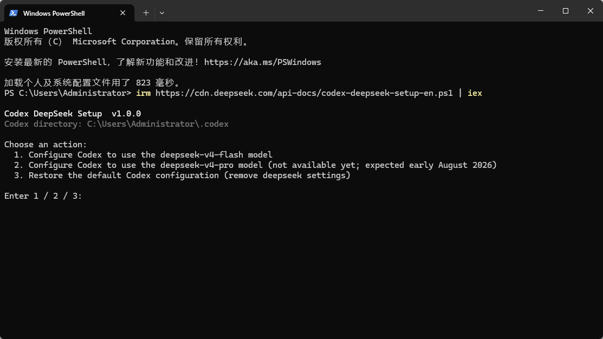
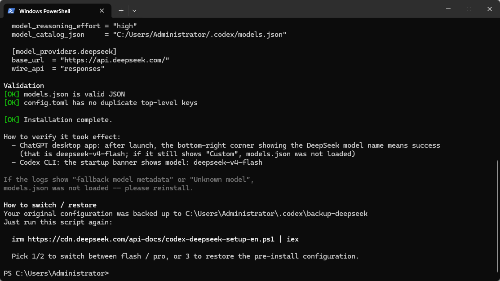
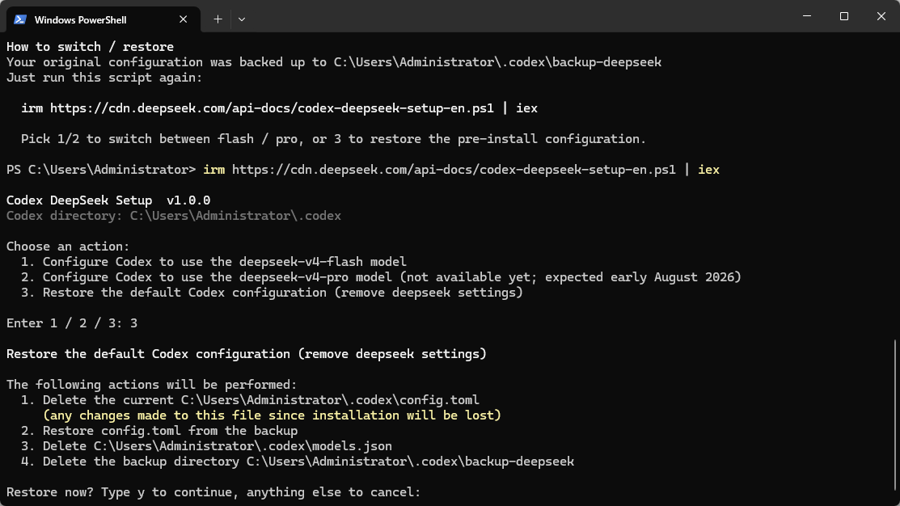

# Windows Codex CLI 使用 DeepSeek，并保留 ChatGPT Plus

> - 整理日期：2026-08-04
> - 适用环境：Windows PowerShell、Codex CLI、ChatGPT / Codex 桌面 App
> - 推荐方案：仅让 CLI 使用 DeepSeek；桌面 App 和普通 Codex 保持 ChatGPT Plus

本文给出两种方式：

| 方式 | 影响范围 | 使用场景 |
| --- | --- | --- |
| **独立 CLI 配置（推荐）** | 仅 codex-deepseek 命令 | 想让 CLI 调用计入 DeepSeek API，桌面 App 继续使用 Plus |
| 全局切换 | CLI、桌面 App、IDE 的默认用户配置 | 确定所有本地 Codex 表面都要使用 DeepSeek |

推荐方式使用独立的 CODEX_HOME。它隔离配置、认证、日志、会话和模型目录；普通 codex 与桌面 App 继续使用默认 %USERPROFILE%\.codex。

> [!WARNING]
> DeepSeek API Key 是敏感凭据。不要把 Key 发到聊天、贴进截图、写入仓库或提交到 Git。本文的命令不会打印 Key；输入 Key 的步骤不要截图。

## 1. 前置条件与限制

开始前应具备：

1. 已安装 Node.js、Codex CLI，并能运行 codex --version；
2. 已在 [DeepSeek 开放平台](https://platform.deepseek.com/) 创建 API Key 并有可用余额；
3. 使用 Windows PowerShell，而不是 WSL 或 Git Bash；
4. 已至少启动过一次 Codex CLI。

当前 DeepSeek Responses API 的 Codex 集成只支持：

    deepseek-v4-flash

不要选择脚本中可能出现、但尚未在 Responses API 中可用的 deepseek-v4-pro。图片、文件输入以及 previous_response_id、conversation、store、background 等状态化能力不受支持；涉及这些功能时应切回 OpenAI 模型。

## 2. 推荐：建立独立 DeepSeek CLI

以下过程仅需执行一次。完成后，codex-deepseek 使用 DeepSeek API；普通 codex 和桌面 App 继续使用 ChatGPT Plus。

### 2.1 用官方脚本生成模型目录

DeepSeek 官方脚本会生成与当前版本匹配的 models.json。在 PowerShell 运行：

    irm https://cdn.deepseek.com/api-docs/codex-deepseek-setup-en.ps1 | iex

在菜单中输入 1，选择 deepseek-v4-flash，再按照提示输入 API Key。

脚本成功时会显示 models.json 校验通过：

> [!IMPORTANT]
> 此时全局 %USERPROFILE%\.codex 会暂时切换到 DeepSeek。下一步先复制模型目录，再立即恢复全局配置；不要在这个临时状态下启动桌面 App 或普通 codex。

### 2.2 复制模型目录到独立状态目录

运行以下完整命令。它创建 %USERPROFILE%\.codex-deepseek 并复制 models.json；若目标目录已存在，会停止而不覆盖。

    $source = Join-Path $env:USERPROFILE '.codex\models.json'
    $targetDir = Join-Path $env:USERPROFILE '.codex-deepseek'

    if (-not (Test-Path -LiteralPath $source -PathType Leaf)) {
        throw "未找到 $source"
    }
    if (Test-Path -LiteralPath $targetDir) {
        throw "目标目录已存在：$targetDir"
    }

    New-Item -ItemType Directory -Path $targetDir -ErrorAction Stop | Out-Null
    Copy-Item -LiteralPath $source -Destination (Join-Path $targetDir 'models.json') -ErrorAction Stop
    Get-Item -LiteralPath (Join-Path $targetDir 'models.json') | Select-Object FullName, Length

预期输出为 .codex-deepseek\models.json 的路径和非零文件大小。

### 2.3 创建不含 API Key 的独立配置

此配置只引用环境变量 DEEPSEEK_API_KEY，不会把 Key 写入 config.toml：

    $configPath = Join-Path $targetDir 'config.toml'
    $catalogPath = (Join-Path $targetDir 'models.json').Replace('\', '/')

    if (Test-Path -LiteralPath $configPath) {
        throw "配置已存在：$configPath；请不要覆盖。"
    }

    @"
    model = "deepseek-v4-flash"
    model_provider = "deepseek"
    model_catalog_json = "$catalogPath"

    [model_providers.deepseek]
    name = "DeepSeek"
    base_url = "https://api.deepseek.com/"
    wire_api = "responses"
    env_key = "DEEPSEEK_API_KEY"
    "@ | Set-Content -LiteralPath $configPath -Encoding utf8NoBOM

    Get-Content -LiteralPath $configPath

确认输出中没有 API Key。

### 2.4 恢复全局 Codex 配置

再次运行官方脚本：

    irm https://cdn.deepseek.com/api-docs/codex-deepseek-setup-en.ps1 | iex

依次输入：

    3
    y

这会恢复安装 DeepSeek 前的全局 config.toml，删除全局 models.json 和临时备份。刚才创建的 %USERPROFILE%\.codex-deepseek 不受影响。

### 2.5 将 Key 保存为当前用户环境变量

以下命令会隐藏输入并把 Key 保存为当前 Windows 用户的 DEEPSEEK_API_KEY。它不会回显 Key，也会同时设置当前终端会话：

    $deepSeekSecure = Read-Host '粘贴 DeepSeek API Key（输入隐藏）' -AsSecureString
    $deepSeekBstr = [IntPtr]::Zero

    try {
        $deepSeekBstr = [Runtime.InteropServices.Marshal]::SecureStringToBSTR($deepSeekSecure)
        $deepSeekValue = [Runtime.InteropServices.Marshal]::PtrToStringBSTR($deepSeekBstr)

        if ([string]::IsNullOrWhiteSpace($deepSeekValue)) {
            throw 'API Key 不能为空。'
        }

        [Environment]::SetEnvironmentVariable('DEEPSEEK_API_KEY', $deepSeekValue, 'User')
        $env:DEEPSEEK_API_KEY = $deepSeekValue
        Write-Host 'DEEPSEEK_API_KEY 已保存为当前用户环境变量。'
    }
    finally {
        if ($deepSeekBstr -ne [IntPtr]::Zero) {
            [Runtime.InteropServices.Marshal]::ZeroFreeBSTR($deepSeekBstr)
        }
        Remove-Variable deepSeekValue, deepSeekSecure, deepSeekBstr -ErrorAction SilentlyContinue
    }

> [!NOTE]
> 当前 Windows 用户下的程序可以读取该用户环境变量。若需要更严格的凭据管理，应使用组织认可的密钥管理方案；不要把 Key 写回 Codex 配置文件。

### 2.6 添加 codex-deepseek 启动命令

此命令把启动函数加入当前 PowerShell Host 的 Profile。函数只在自身运行期间设置 CODEX_HOME，退出后恢复终端原环境：

    $profilePath = $PROFILE
    $profileDir = Split-Path -Parent $profilePath
    $marker = '# >>> Codex DeepSeek launcher >>>'

    if (-not (Test-Path -LiteralPath $profileDir)) {
        New-Item -ItemType Directory -Path $profileDir -Force | Out-Null
    }
    if ((Test-Path -LiteralPath $profilePath) -and
        (Select-String -LiteralPath $profilePath -SimpleMatch -Pattern $marker -Quiet)) {
        throw "启动命令已存在于：$profilePath"
    }

    $launcher = @'
    # >>> Codex DeepSeek launcher >>>
    function codex-deepseek {
        [CmdletBinding()]
        param(
            [Parameter(ValueFromRemainingArguments = $true)]
            [string[]]$CodexArgs
        )

        $deepSeekHome = Join-Path $env:USERPROFILE '.codex-deepseek'
        if (-not (Test-Path -LiteralPath $deepSeekHome -PathType Container)) {
            throw "未找到独立 DeepSeek 配置目录：$deepSeekHome"
        }

        $previousCodexHome = [Environment]::GetEnvironmentVariable('CODEX_HOME', 'Process')
        try {
            $env:CODEX_HOME = $deepSeekHome
            & codex @CodexArgs
        }
        finally {
            if ($null -eq $previousCodexHome) {
                Remove-Item Env:CODEX_HOME -ErrorAction SilentlyContinue
            }
            else {
                $env:CODEX_HOME = $previousCodexHome
            }
        }
    }
    # <<< Codex DeepSeek launcher <<<
    '@

    Add-Content -LiteralPath $profilePath -Value $launcher -Encoding utf8NoBOM
    . $profilePath
    Get-Command codex-deepseek | Select-Object Name, CommandType, Source

最后一行应显示 codex-deepseek，且 CommandType 为 Function。

## 3. 验证与日常使用

### 3.1 首次启动

打开新 PowerShell，运行：

    codex-deepseek

启动栏应显示：

    model: deepseek-v4-flash

首次在 Windows 上运行时，Codex 可能询问 sandbox 设置：

1. 选择 1. Set up default sandbox；如弹出 UAC，确认管理员授权；
2. 若默认设置因权限失败，退出后重试并选择 2. Use non-admin sandbox。

输入下列最小测试并发送：

    只回复 OK

收到 OK 即表示请求已成功通过 DeepSeek API 发送和返回。

### 3.2 以后如何区分两种入口

| 要使用的模型与额度 | 命令或入口 |
| --- | --- |
| DeepSeek API | codex-deepseek |
| ChatGPT Plus | 普通 codex 或桌面 App |

codex-deepseek 退出后会自动恢复当前终端的 CODEX_HOME。DeepSeek 的实际费用从其 API 账户余额中扣除，不消耗 ChatGPT Plus 的 Codex 额度。

### 3.3 在独立 CLI 中选择多个模型

独立 CLI 的 config.toml 只定义**默认模型**。模型目录中有多个受支持模型时，不需要建立多个 CODEX_HOME，也不需要修改 API Key、提供方配置或启动函数；使用命令行参数覆盖默认模型即可：

    # 使用默认模型（当前为 Flash）
    codex-deepseek

    # 显式指定 Flash
    codex-deepseek --model deepseek-v4-flash

    # 仅在 DeepSeek 官方宣布 Responses API 支持后使用 Pro
    codex-deepseek --model deepseek-v4-pro

也可在已启动的 Codex CLI 中输入：

    /model

再从可用列表中选择模型。该切换只作用于当前会话。

> [!IMPORTANT]
> 截至本文整理日期，deepseek-v4-pro 尚不支持 DeepSeek Responses API，因此现在只能实际调用 Flash。即使模型目录中出现 Pro，也不要在官方支持前尝试调用它。

### 3.4 DeepSeek 增加 Pro 支持后的更新步骤

当 [DeepSeek Responses API 文档](https://api-docs.deepseek.com/zh-cn/guides/responses_api/) 明确列出 deepseek-v4-pro 后，按以下顺序刷新独立 CLI 的模型目录：

1. 运行官方脚本并选择 2，让它生成匹配 Pro 的全局 models.json；
2. 备份并用该文件覆盖独立目录中的 models.json：

       $source = Join-Path $env:USERPROFILE '.codex\models.json'
       $target = Join-Path $env:USERPROFILE '.codex-deepseek\models.json'
       Copy-Item -LiteralPath $target -Destination "$target.bak" -ErrorAction Stop
       Copy-Item -LiteralPath $source -Destination $target -Force -ErrorAction Stop

3. 再次运行官方脚本，选择 3 并输入 y，恢复全局 %USERPROFILE%\.codex；
4. 保持 config.toml 的默认 Flash 不变，先运行：

       codex-deepseek --model deepseek-v4-pro

5. 确认启动栏显示 deepseek-v4-pro，再发送“只回复 OK”。

若希望以后默认启动 Pro，再把独立 %USERPROFILE%\.codex-deepseek\config.toml 中的 model 改为：

    model = "deepseek-v4-pro"

以上操作不会影响 DEEPSEEK_API_KEY、CODEX_HOME、codex-deepseek 启动函数，也不会改变桌面 App 的 Plus 配置。

## 4. 备选：全局切换到 DeepSeek

仅当希望 CLI、桌面 App 与 IDE 都使用 DeepSeek 时，才使用这一方式：

    irm https://cdn.deepseek.com/api-docs/codex-deepseek-setup-en.ps1 | iex

选择 1 配置 deepseek-v4-flash。该脚本会修改默认 %USERPROFILE%\.codex，因此所有共享该配置的 Codex 表面都会受影响。

恢复 ChatGPT / OpenAI 默认配置时，重新运行脚本并输入：

    3
    y

恢复会覆盖全局 config.toml。若配置 DeepSeek 后修改过 MCP、权限或其他全局设置，应先备份相关文件。

## 5. 常见问题

### codex-deepseek 不存在

关闭并重新打开 PowerShell；若仍不存在，重新执行“添加 codex-deepseek 启动命令”的步骤，并检查 $PROFILE 是否被企业策略禁用。

### 启动后不是 deepseek-v4-flash

检查 %USERPROFILE%\.codex-deepseek\config.toml 是否包含：

    model = "deepseek-v4-flash"
    model_provider = "deepseek"
    env_key = "DEEPSEEK_API_KEY"

同时确认 %USERPROFILE%\.codex-deepseek\models.json 存在。

### 提示 Key 缺失、401 或余额不足

确认新 PowerShell 已读取 DEEPSEEK_API_KEY，并在 DeepSeek 平台检查 Key 状态、API 余额与调用记录。不要使用 codex login 来输入 DeepSeek Key。

### API Key 疑似泄露

立即在 DeepSeek 平台删除旧 Key，创建新 Key，并重新执行“保存当前用户环境变量”的步骤。检查终端历史、截图和版本控制记录中是否出现过该 Key。

## 6. 官方参考资料

- [DeepSeek Codex 集成说明](https://api-docs.deepseek.com/zh-cn/quick_start/agent_integrations/codex/)
- [DeepSeek Responses API](https://api-docs.deepseek.com/zh-cn/guides/responses_api/)
- [DeepSeek 开放平台](https://platform.deepseek.com/)
- [OpenAI Codex Configuration Reference](https://developers.openai.com/codex/config-reference/)
- [OpenAI Codex Advanced Configuration](https://developers.openai.com/codex/config-advanced/)
- [OpenAI Codex Environment Variables](https://developers.openai.com/codex/environment-variables/)
