# 台式主机清灰：完整流程与注意事项

整理自 be quiet! 官方视频 [《PC Cleaning 101》](https://www.youtube.com/watch?v=MzeA68RMoF0)（时长 5:29，截图标注了视频时间点），并合并了针对自己 RTX 5070 Ti 主机的「小白安全版」清灰方案。

两者做法不同处用 **路线 A（日常安全版）** 和 **路线 B（深度清理版）** 区分。

---

## 00 为什么要清灰

灰尘沉积在硬件上会**阻碍风道气流**，并像隔热层一样**包裹散热器鳍片**，让散热效率下降。温度升高之后，结果要么是性能下降（降频），要么是风扇转速拉高、噪音变大。所以清灰不只是为了好看，更是让整机长期保持性能和稳定运行的例行维护。视频中演示者的机器（Pure Base 500DX）装机两年只清过防尘网，内部已经积了不少灰。

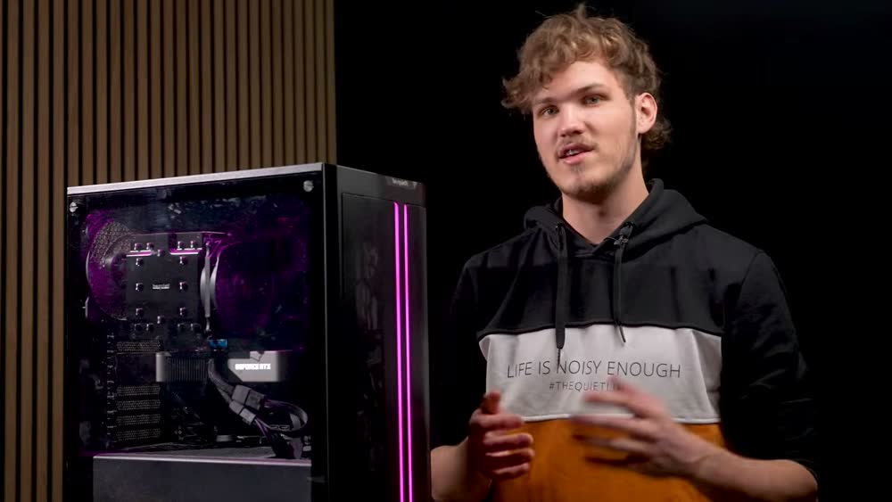
> `0:33` 演示用机：装机两年、只清理过防尘网的 Pure Base 500DX。

## 01 先选路线：拆多深？

视频演示的是完整拆解的深度清理；对于不熟悉硬件的用户或者较新的高端整机（如 RTX 5070 Ti 主机），日常维护用不拆件的安全路线即可。

| | 路线 A · 日常安全版 | 路线 B · 深度清理版（视频流程） |
|---|---|---|
| 定位 | 小白友好 · 定期维护 · 风险低 | 动手能力要求高 · 用了几年、积灰严重 |
| 拆卸范围 | **只拆**玻璃侧板、防尘网；**不拆**显卡、CPU 散热器、电源 | 拆下风扇、CPU 散热器、显卡逐件清理；电源拆出机箱（但**绝不拆开外壳**） |
| 主力工具 | 电动气吹 + 防静电刷 | 同左，另可换 CPU 硅脂 |
| 特点 | 所有部件原位清理 | 清理更彻底，耗时更长 |

## 02 工具准备

### 核心工具（个人在用）

| 工具 | 选用 | 用途 |
|---|---|---|
| 电动气吹 | [米瑞思 BS2 暴力风扇](https://item.jd.com/100372844808.html)（京东自营） | 吹走灰尘、清理显卡散热鳍片；可充电、无罐装空气的制冷剂残留风险，可长期重复使用 |
| 防静电刷 | [史丹利 STANLEY 66-014-23](https://item.jd.com/100132040715.html)（京东自营） | 松动粘附的灰尘，配合气吹使用；带 ESD 认证标识的防静电排刷，刷毛精密不易变形，适合主板/显卡等精密元件 |
| 超细纤维布 | 普通即可 | 擦机箱外壳、防尘网 |
| 软毛刷（可选） | [鹿仙子细软毛刷三件套](https://item.jd.com/10118475097480.html)（长款 + 短款 + 伸缩款） | 大面积浮灰专用：防尘网、机箱外壳、玻璃面板、键盘、风扇叶正面。无 ESD 认证，**不要用于主板/显卡的电路板（PCB）**——精密元件一律交给史丹利防静电排刷 |
| 导热材料（重装散热器时） | [京锴 PTM7950 相变导热片](https://item.jd.com/100285058698.html)（京东自营，8.5 W/mK，附酒精湿巾/指套等工具） | 替代传统硅脂，抗泵出、寿命长。**注意选对规格**：20×30mm 是笔记本芯片尺寸，桌面 CPU 顶盖约 40×40mm（AM5）/ 45×37.5mm（LGA1700+），需选 ≥40×40 的规格才能盖满 |

### 视频中出现的其他工具（按需）

带刷头的吸尘器 · 压缩空气罐 · 棉签（可微微沾湿）· 无绒布 + 异丙醇（换硅脂用）· 新硅脂（路线 B 可选）· 玻璃清洁剂（侧透面板）· 手电筒（检查电源内部）

> **选型说明**
>
> 视频也提到：可充电的电动吹尘枪是压缩空气罐的良好替代——没有倾斜喷出制冷剂的问题，长期成本更低。这正是「米瑞思」这类电动气吹的定位。
>
> **已核实（京东商品页）**：BS2 基础版为无刷电机，120,000 r/min、180g 风压，带档位/电量显示屏（档位可调，支持"低档起步"），附多组合风嘴，吹吸一体（含集尘杯），符合本方案全部要求。注意它风力很强——「固定风扇、低档开始、保持距离」三条纪律务必执行。
>
> **关于刷子的选择**：接触主板、显卡 PCB 的刷子认准带 ESD 标识的专业防静电刷（如史丹利排刷，刷杆印有 "APPROVED STATIC CONTROL"）；网售的"防静电细软毛刷"套装（如鹿仙子三件套）多为宣传性说法、无 ESD 认证，软大刷头适合扫机箱外壳、滤网、风扇叶等大面积浮灰，可作补充，但不建议在精密元件上替代前者。

## 03 动手前：环境与断电

### 选好清灰环境

- **推荐**：阳台、室外、通风区域——既不把灰吹回屋里，也避免自己吸入扬尘（视频同样建议把部件拿到室外吹）。
- **避免**：床边、地毯环境——织物环境本身就是灰尘和静电的来源。

### 断电四步

1. Windows 正常关机
2. 关闭电源后侧的硬开关（I/O 拨到 O）
3. 拔掉电源线
4. **按一次开机键**，释放主板残余电荷

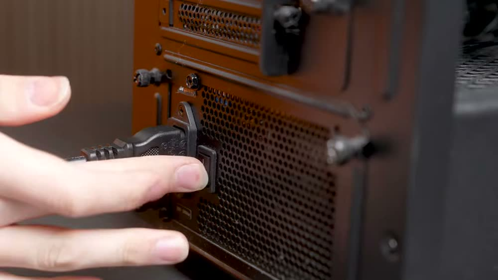
> `0:43` 关闭电源硬开关、拔下电源线之后再动手。

## 04 防尘滤网

防尘滤网通常有三处：**前面板后面**、**机箱顶部**，以及容易被忘掉的**电源底部进风口**。不同机箱的固定方式不同：有的是磁吸，有的是卡扣，有的插在导轨里；有些机箱需要先拆下前面板才能拿到前置滤网；底部滤网一般向前或向后抽出。

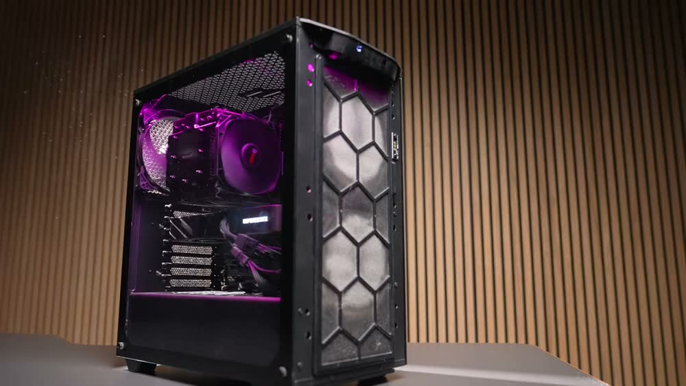
> `1:00` 拆下前面板才能拿到前置滤网。

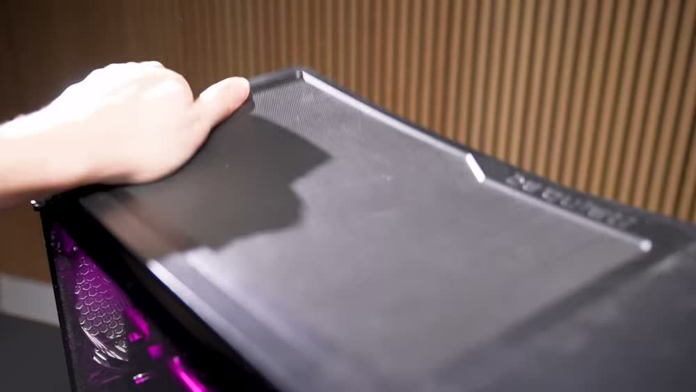
> `1:06` 顶部滤网为磁吸式，直接揭下。

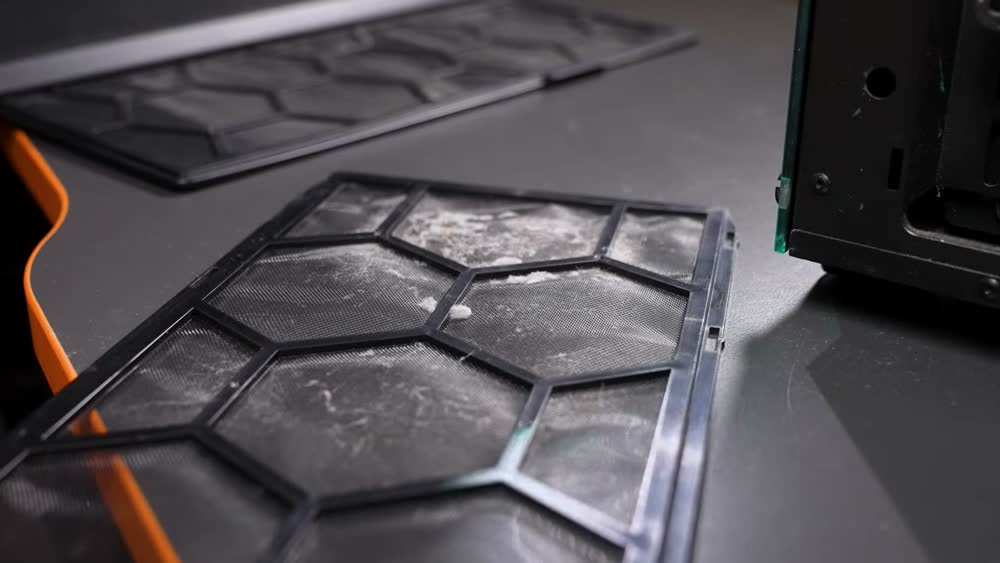
> `1:09` 拆下来的滤网，积灰非常明显。

两种清理方式：

- **快速清理**：吸尘器 + 刷头直接吸，或气吹 + 超细纤维布。
- **彻底清理**：滤网是纯塑料/网布的话可以直接水洗。

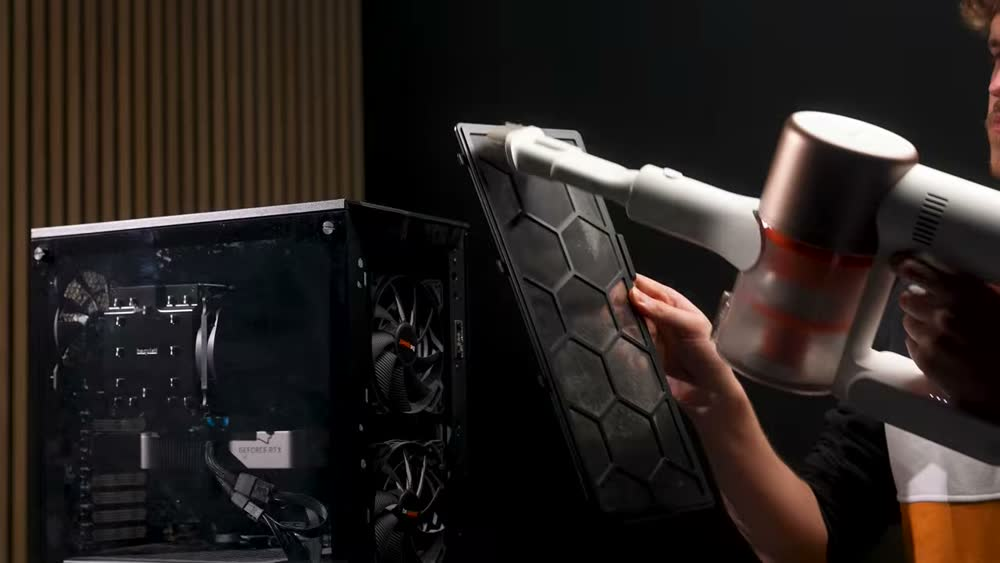
> `1:12` 日常快速清理：吸尘器带刷头。

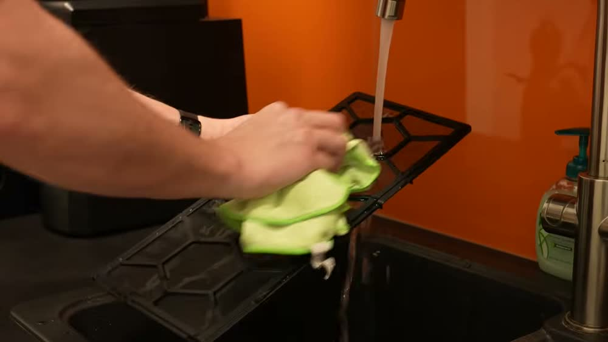
> `1:16` 彻底清理：直接水洗。

> ⚠️ **注意**：水洗后的滤网必须**完全晾干**再装回机箱，带潮气装回等于把水汽引进机箱。

## 05 机箱内部：纪律与气吹用法

进入机箱内部后要格外小心，视频反复强调三点纪律：

- **不用水。** 内部元件一律干式清理。
- **吸尘器只用来吸机箱底部的粗灰。** 务必远离主板、显卡等精密部件——吸尘器既可能产生**静电击穿元件**，也可能把小零件（跳线帽、螺丝等）直接吸走。
- **敏感区域改用气吹或软毛刷。** 总原则：吹为主，刷为辅。

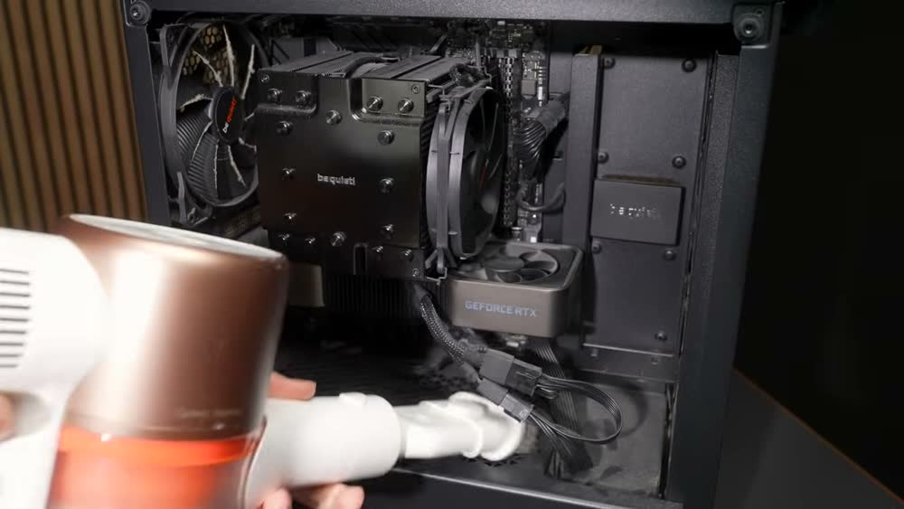
> `1:34` 吸尘器只对机箱底板使用，避开主板和显卡。

### 电动气吹使用方法

- **第一次使用不要直接开最大档**：低档 → 观察 → 逐渐提高。
- **保持距离**：普通区域 15~20 cm；显卡鳍片 10~20 cm。喷嘴不要贴近元件。
- **吹的方向**：远离自己、远离其他部件，从内向外把灰"赶"出机箱，而不是吹进更深的缝隙。

### 如果用的是罐装压缩空气

- 必须**水平持握**：倾斜或倒置会喷出液态制冷剂，在元件上留下有害的冷凝残留。

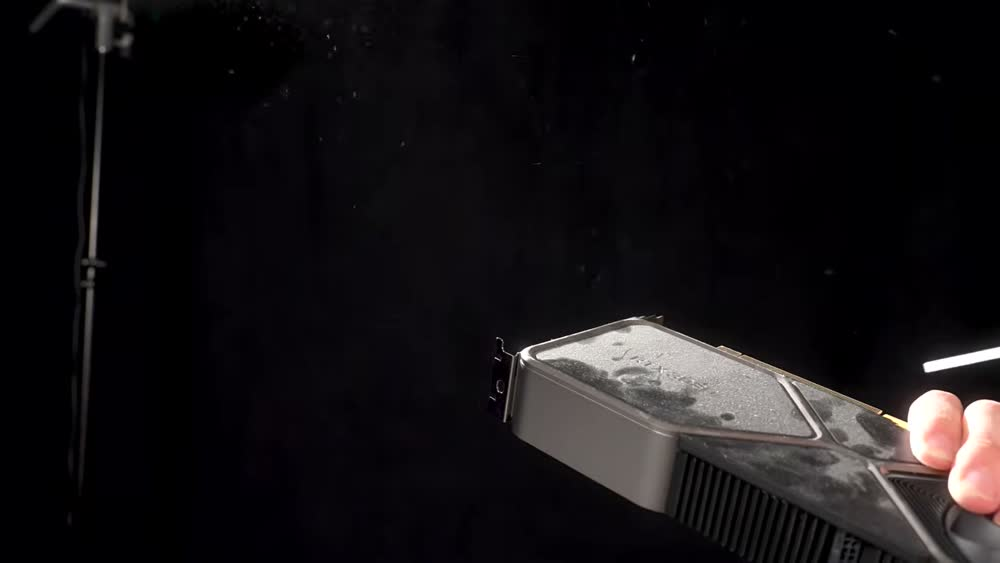
> `1:52` 朝远离元件的方向吹，最好在室外操作。

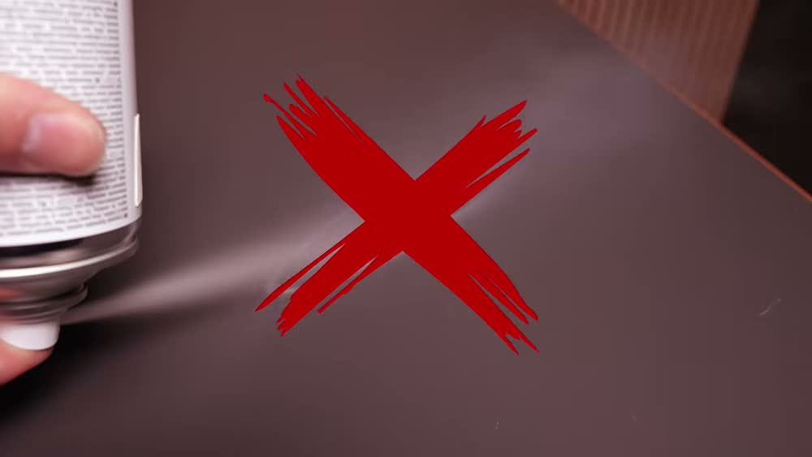
> `2:07` 错误示范：气罐倾斜/倒置会喷出制冷剂。

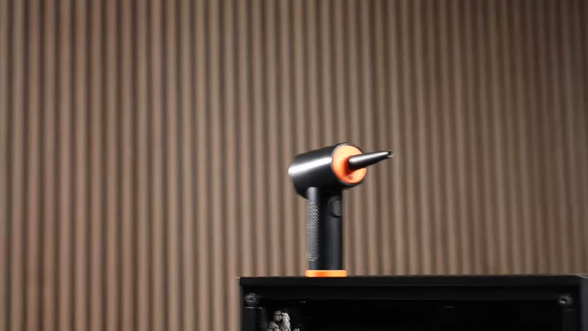
> `2:17` 电动气吹：可充电，无残留风险，替代一次性气罐。

## 06 风扇：先固定，再吹

风扇是清灰重点，但也最容易被吹坏：**气流太强会损伤轴承，甚至吹断扇叶**。电动气吹风力较强，吹之前先把风扇固定住——**显卡风扇、CPU 风扇、机箱风扇都要固定**。

- **固定方式**：手指轻挡风扇中心（轴心处），不压扇叶、不用力。
- **吹的力度**：低档位起步，或保持距离，把大部分浮灰吹掉即可。
- **顽固污渍**：用微微沾湿的棉签逐片擦扇叶。

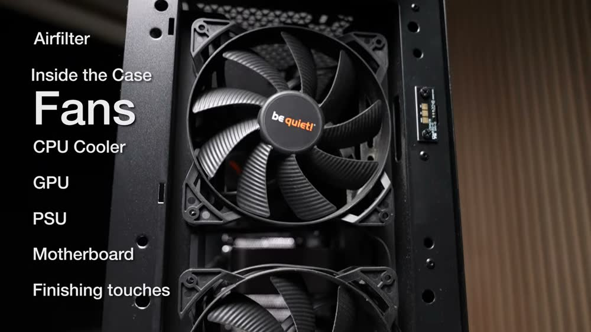
> `2:27` 吹风扇时用低档、保持距离，防止轴承受损。

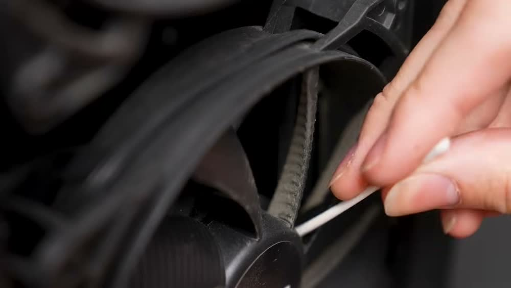
> `2:35` 顽固污渍：微湿棉签逐片擦拭。

## 07 CPU 散热器（风冷 / 水冷排同理）

**路线 A** —— 原位清理：先用防静电刷把鳍片间隙的灰**刷松**，再用气吹**带走**。重点是鳍片间隙。

**路线 B** —— 视频做法：把散热器从 CPU 插座拆下（先拆显卡腾出空间更好操作），风扇拆下单独清理，鳍片用足量压缩空气吹透。水冷的冷排同理。

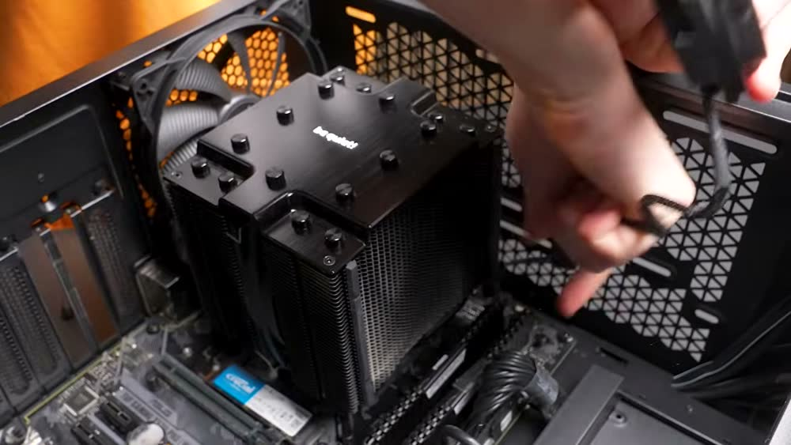
> `2:44` 路线 B：拆下散热器（先拆显卡更好操作）。

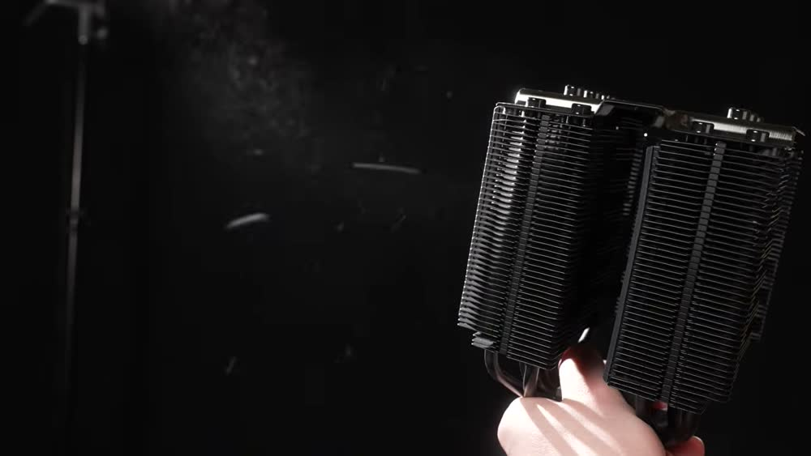
> `2:53` 鳍片积灰用气流吹透，可见灰尘飞出。

### 换硅脂：什么时候必须换

满足任一条件就要重涂，不看硅脂用了多久：

- **散热器从 CPU 上取下过**（包括搬运前拆下散热器的情况）——旧硅脂界面一旦破坏就有气隙，直接压回去导热会变差，**必须清掉重涂**；
- 整机用了**好几年**，清灰后 CPU 温度仍明显偏高。

操作流程：

1. **两个面都擦**：CPU 顶盖 + 散热器底座，用无绒布蘸**异丙醇**（或酒精湿巾）把旧硅脂全部擦净，等完全挥发；
2. 涂新导热材料（见下）；
3. 装回散热器：**对角线顺序分次拧紧**螺丝，压力均匀，不要一颗拧到底；
4. **插回 CPU_FAN 风扇线**（最容易漏的一步）；
5. 开机进 BIOS / HWiNFO 看 CPU 待机温度（35~50°C 正常）。

传统硅脂涂法：中心豌豆大小一粒（或细 X 形），宁少勿多。

**若用 PTM7950 相变片**（见工具表）：先连包装冷藏/冷冻 10~20 分钟再撕膜（常温下软粘难操作），贴到 CPU 顶盖上，撕掉另一面膜后装散热器；前几次开机升温后材料相变填充，属正常现象。规格必须能盖满顶盖（桌面 CPU 选 ≥40×40mm）。

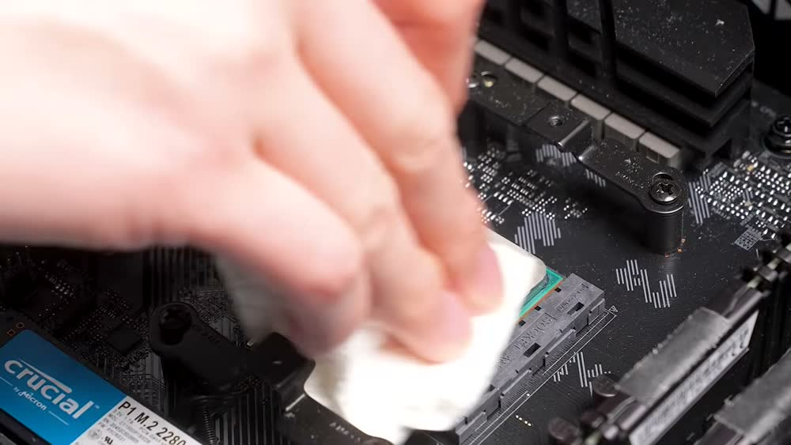
> `3:04` 布 + 异丙醇擦掉旧硅脂，重新涂抹后再装回。

## 08 显卡（RTX 5070 Ti 重点）

显卡风扇本身不易拆卸，两条路线的差别只在于**卡拆不拆出机箱**：

**路线 A** —— 显卡留在机箱内原位清理：

1. 史丹利防静电刷轻扫风扇叶片，松动积灰；
2. 电动气吹吹走灰尘；
3. 散热鳍片**从侧面吹**：气流 → 鳍片 → 灰尘排出，**不要长时间正对风扇猛吹**。

**路线 B** —— 视频做法：把显卡拆下拿到室外，气流**绕过风扇、从鳍片穿过**，扇叶用刷子或棉签逐片清理。

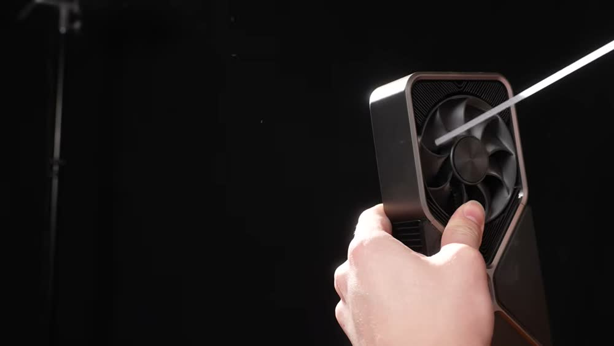
> `3:27` 气流从鳍片穿过而非正吹风扇，扇叶用刷子/棉签清理。

## 09 主板区域

主板上小元件密集，是最需要轻手轻脚的部分。原则：**吹为主、刷为辅**——软毛刷/防静电刷 + 气吹组合，**低档、远距离、不碰元件**。不用吸尘器，不用水。

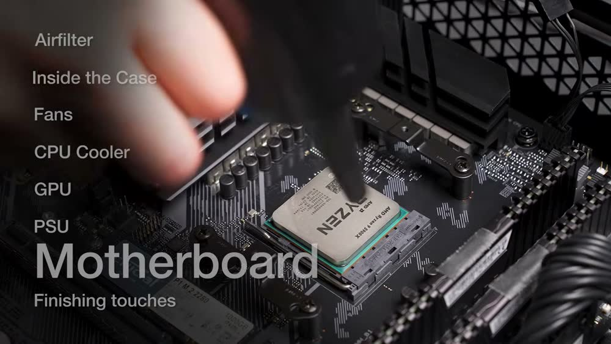
> `4:31` 主板只用软毛刷和气吹，动作要轻。

## 10 电源（PSU）

**路线 A** —— 只清理**外部进风口**和**外部防尘网**，电源不动。

**路线 B** —— 视频做法：电源拆出机箱后，先用**手电筒**从风扇格栅往里照，确认内部是否真的积灰；有积灰就用少量气流**从风扇旁边吹进去**。

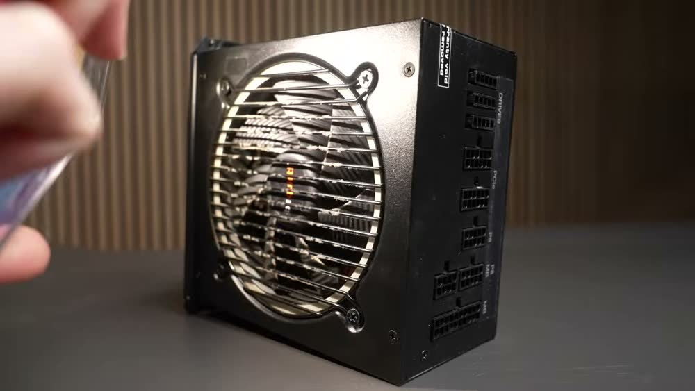
> `4:13` 手电筒照进风扇格栅，先确认积灰情况。

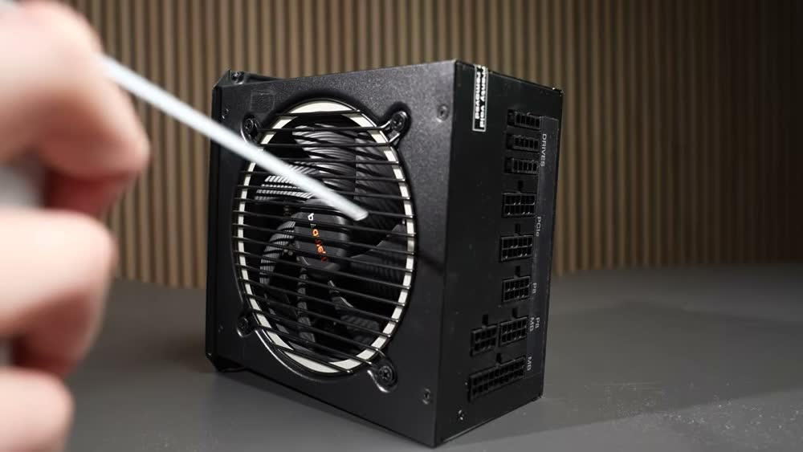
> `4:23` 用气流绕过风扇吹内部，不要拆壳。

> ☠️ **危险**：无论哪条路线，**绝对不要拆开电源外壳**。内部电容在断电后仍会长时间存有电荷，可能造成危险。

## 11 推荐清灰顺序

按**从上到下、从内到外**的顺序，避免吹落的灰重新落在已清理的部件上：

1. 顶部防尘网
2. CPU 散热器
3. 显卡
4. 主板区域
5. 机箱底部
6. 电源外部

## 12 复原、检查与开机测试

### 装回前先检查

- 显卡鳍片、CPU 散热器是否还有残留灰尘；
- 风扇转动是否正常（手拨应顺滑无异响）；
- **显卡供电线、主板供电线是否松动**——清理过程容易碰松接头。

### 复原

路线 B 按拆卸反顺序装回：风扇 → CPU 散热器 → 显卡 → 电源。之后两条路线相同：

- 装回防尘网；
- 侧透玻璃面板用**玻璃清洁剂**擦干净再装回；
- 机箱外壳用超细纤维布整体擦一遍；
- 插回电源线。

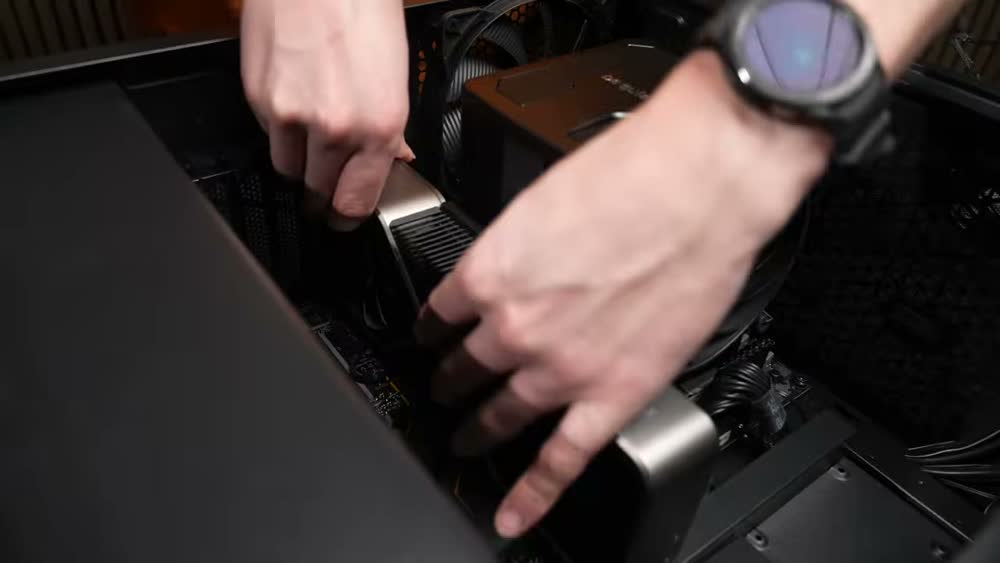
> `4:42` 按反顺序装回各部件。

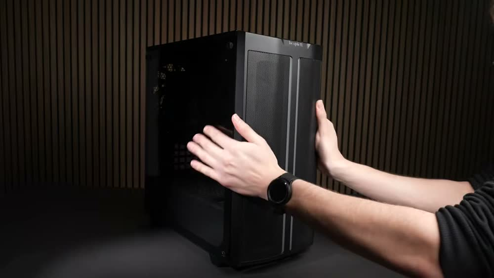
> `4:51` 玻璃侧板清洁后装回，最后擦净机箱。

### 首次开机观察

- 显卡风扇、CPU 风扇是否正常启转；
- 有无异常声音（扇叶刮擦、轴承异响）。

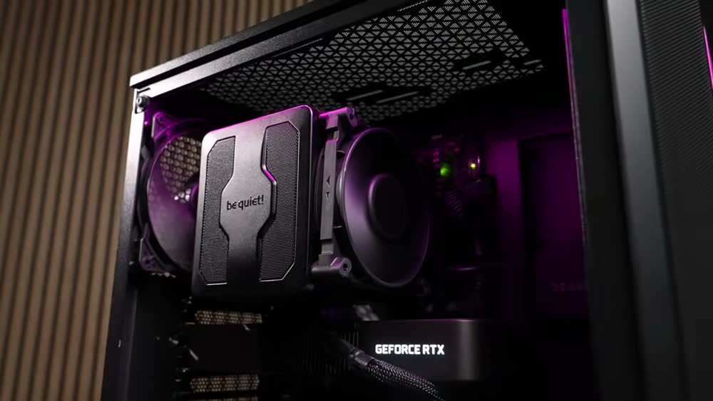
> `5:03` 完工：内部焕然一新，散热恢复满血。

## 13 安全规则与速查表

### 五条铁律

- ✅ 固定风扇再吹
- ✅ 低档开始，逐渐提高
- ✅ 保持距离（15~20 cm）
- ✅ 从内向外吹
- ✅ 不拆电源

### 速查表

| 场景 | 能做 | 不能做 |
|---|---|---|
| 动手之前 | 关机 → 关电源开关 → 拔线 → 按开机键放电；到阳台/室外操作 | 带电操作；在床边、地毯环境清灰 |
| 防尘滤网 | 吸尘器快速清理；水洗后彻底晾干 | 没晾干就装回 |
| 机箱内部 | 气吹、防静电刷；吸尘器仅限箱底粗灰 | 用水；吸尘器靠近主板/显卡（静电、吸走小件） |
| 电动气吹 | 低档起步；15~20 cm；固定风扇后再吹 | 第一次就开最大档；喷嘴贴近元件 |
| 压缩空气罐 | 水平持握；朝外吹；最好到室外 | 倾斜/倒置使用（喷制冷剂）；把灰吹进缝隙 |
| 风扇 | 手指轻挡轴心固定；低档或保持距离；微湿棉签擦顽固污渍 | 强风直吹空转（伤轴承、断扇叶）；压扇叶 |
| 显卡 | 鳍片从侧面吹透；刷+气吹清扇叶 | 长时间正对风扇猛吹 |
| 电源 | 清外部进风口/防尘网；（路线 B）手电筒检查、从风扇旁吹气 | **拆开电源壳**（电容余电危险） |
| 硅脂 | （路线 B）使用多年时趁机更换；异丙醇清理旧硅脂 | — |

---

视频内容与截图出自 be quiet! 官方频道《PC Cleaning 101》（youtube.com/watch?v=MzeA68RMoF0）；「路线 A · 日常安全版」为针对 RTX 5070 Ti 主机的个人方案。仅作个人学习笔记。
